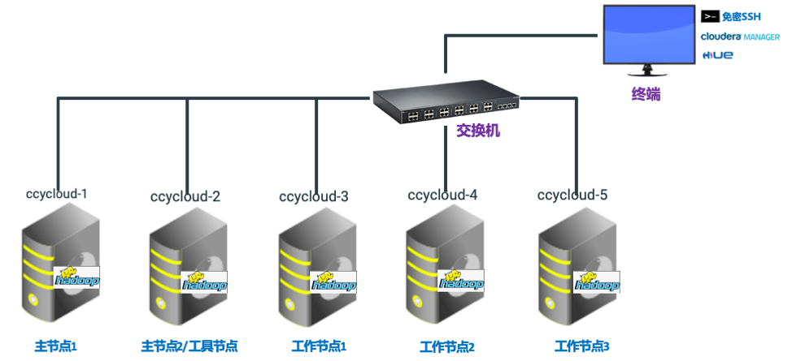

= 前置工作之系统检查

**目录**

. 演示环境介绍 +
.. <<修改hosts文件>> +
.. <<免密登录>> +
.. <<准备离线安装包>> +
.. <<配置httpd服务>> +
.. <<配置本地repo源>> +
.. <<运行脚本install_full_script.sh>>
. 集群主机配置修改 +
.. <<禁用SELinux>> +
.. <<关闭防火墙>> +
.. <<集群时钟同步>> +
.. <<更改文件句柄数>> +
.. <<设置swap>> +
.. <<设置透明大页面>> +
.. <<配置repo>>

== 演示环境介绍

**注意：** 建议所有的操作都在 `终端服务器` 上完成，包括远程执行script.sh和CM页面操作。

=== 修改hosts文件

普通Linux服务器：
....
echo "127.0.0.1   localhost localhost.localdomain localhost4 localhost4.localdomain4
::1         localhost localhost.localdomain localhost6 localhost6.localdomain6
172.27.14.129   ccycloud-1.feng.root.hwx.site   feng-1
172.27.170.65   ccycloud-2.feng.root.hwx.site   feng-2
172.27.115.6   ccycloud-3.feng.root.hwx.site   feng-3
172.27.17.134   ccycloud-4.feng.root.hwx.site   feng-4
172.27.126.77   ccycloud-5.feng.root.hwx.site   feng-5
" > /etc/hosts
....

YCloud Linux服务器：
....
echo "127.0.0.1	localhost
::1	localhost ip6-localhost ip6-loopback
fe00::0	ip6-localnet
ff00::0	ip6-mcastprefix
ff02::1	ip6-allnodes
ff02::2	ip6-allrouters
172.27.14.129   ccycloud-1.feng.root.hwx.site   feng-1
172.27.170.65   ccycloud-2.feng.root.hwx.site   feng-2
172.27.115.6   ccycloud-3.feng.root.hwx.site   feng-3
172.27.17.134   ccycloud-4.feng.root.hwx.site   feng-4
172.27.126.77   ccycloud-5.feng.root.hwx.site   feng-5
" > /etc/hosts
....

=== 免密登录

终端服务必须和集群各节点配置免密登录。
....
# 登录终端服务器
ssh-keygen ##一直敲回车到最后
ssh-copy-id -i ~/.ssh/id_rsa.pub root@ccycloud-1.feng.root.hwx.site
ssh-copy-id -i ~/.ssh/id_rsa.pub root@ccycloud-2.feng.root.hwx.site
ssh-copy-id -i ~/.ssh/id_rsa.pub root@ccycloud-3.feng.root.hwx.site
ssh-copy-id -i ~/.ssh/id_rsa.pub root@ccycloud-4.feng.root.hwx.site
ssh-copy-id -i ~/.ssh/id_rsa.pub root@ccycloud-5.feng.root.hwx.site
....

== 准备离线安装包

.下载地址

|===
|组件 |下载链接

|CDH7.1.1
|https://archive.cloudera.com/cdh7/7.1.1.0/parcels/

|CM7.1.1
|https://archive.cloudera.com/cm7/7.1.1/redhat7/yum/

|CSA/Flink
|https://www.cloudera.com/downloads/cdf/csa.html

|CFM/NiFi
|https://www.cloudera.com/downloads/cdf/cfm.html

|CEM/EFM&Minifi
|https://www.cloudera.com/downloads/cdf/cem.html

|WXM
|https://www.cloudera.com/downloads/workloadxm.html

|CDSW
|https://archive.cloudera.com/cdsw1/1.7.2/parcels/

|postgresql-10
|https://download.postgresql.org/pub/repos/yum/debug/10/redhat/rhel-7.7-x86_64/
|===

**注意：**

* Cloudera Manager安装需要6个rpm包以及一个asc文件
....
https://archive.cloudera.com/cm7/7.1.1/redhat7/yum/RPMS/x86_64/cloudera-manager-agent-7.1.1-3274282.el7.x86_64.rpm
https://archive.cloudera.com/cm7/7.1.1/redhat7/yum/RPMS/x86_64/cloudera-manager-daemons-7.1.1-3274282.el7.x86_64.rpm
https://archive.cloudera.com/cm7/7.1.1/redhat7/yum/RPMS/x86_64/cloudera-manager-server-7.1.1-3274282.el7.x86_64.rpm
https://archive.cloudera.com/cm7/7.1.1/redhat7/yum/RPMS/x86_64/cloudera-manager-server-db-2-7.1.1-3274282.el7.x86_64.rpm
https://archive.cloudera.com/cm7/7.1.1/redhat7/yum/RPMS/x86_64/enterprise-debuginfo-7.1.1-3274282.el7.x86_64.rpm
https://archive.cloudera.com/cm7/7.1.1/redhat7/yum/RPMS/x86_64/openjdk8-8.0+232_9-cloudera.x86_64.rpm
https://archive.cloudera.com/cm7/7.1.1/allkeys.asc
....

* parcel包需要下全三类文件：*.parcel, *.parcel.sha，manifest.json，例如：
....
https://archive.cloudera.com/cdh7/7.1.1.0/parcels/CDH-7.1.1-1.cdh7.1.1.p0.3266817-el7.parcel
https://archive.cloudera.com/cdh7/7.1.1.0/parcels/CDH-7.1.1-1.cdh7.1.1.p0.3266817-el7.parcel.sha256
https://archive.cloudera.com/cdh7/7.1.1.0/parcels/manifest.json
....

=== 配置httpd服务

Step1.  在终端服务器上安装httpd服务
....
yum -y install httpd
....

Step2.  修改/etc/httpd/conf/httpd.conf配置文件，在<IfModule mime_module>中修改以下内容：
....
AddType application/x-gzip .gz .tgz `.parcel
....

Step3.  保存httpd.conf的修改，并重启httpd服务
....
systemctl restart httpd
systemctl enable httpd
....

=== 配置本地repo源

Step1.  登录终端服务器

Step2.  先挂载操作系统iso文件，然后拷贝到/var/www/html目录
....
mkdir /media/DVD1
mount -o loop CentOS-7-x86_64-DVD-1611.iso /media/DVD1/
mkdir /var/www/html/iso
cp -r /media/DVD1/* /var/www/html/iso/
....

Step3.  将Cloudera Manager安装需要的6个rpm包以及一个asc文件转移到/var/www/html目录 +
然后执行createrepo命令生成rpm元数据。
....
mv cm7.1/ /var/www/html/
createrepo /var/www/html/cm7.1
....

Step4.  将安装postgresql-10需要的rpm包转移到/var/www/html目录 +
然后执行createrepo命令生成rpm元数据。
....
mv postgresql-10/ /var/www/html/
createrepo /var/www/html/postgresql-10
....

Step5.  将CDP安装需要的三个文件转移到/var/www/html目录
....
mv cdh7.1/ /var/www/html/
....

Step6.  其他的rpm包采取类似于CM的方法，parcel包采取类似于CDP的方法。

Step7.  验证浏览器http://<IP_ADDRESS>/cm7.1能否正常访问  

=== 运行脚本install_full_script.sh

. 打开link:install_full_script.sh[install_full_script.sh]，将其中的**部分代码**拷贝到link:script.sh[script.sh]中 +
. 在配置免密登录之后，在**终端服务器**上可以通过以下方式执行脚本：+
.. sh link:single_thread_execution.sh[single_thread_execution.sh] +
.. sh link:multi_thread_execution.sh[multi_thread_execution.sh]

== 集群主机配置修改

以下部分可以通过link:install_full_script.sh[install_full_script.sh]执行生效。 +
执行方法参见<<运行脚本install_full_script.sh>>

=== 禁用SELinux
....
sed -i 's/SELINUX=.*/SELINUX=disabled/' /etc/selinux/config
setenforce 0
getenforce
....

=== 关闭防火墙
....
systemctl disable firewalld
systemctl stop firewalld
systemctl status firewalld
....

=== 集群时钟同步

先卸载chrony，然后安装ntp，使用ntp来配置各台主机的时钟同步。
....
yum -y remove chrony
yum -y install ntp
systemctl start ntpd
systemctl status ntpd
....

可以将CM服务器作为本地ntp服务器，其它4台主机与其保持同步。

CM服务器配置时钟与自己同步：

vim /etc/ntp.conf
....
#server 0.rhel.pool.ntp.org iburst
#server 1.rhel.pool.ntp.org iburst
#server 2.rhel.pool.ntp.org iburst
#server 3.rhel.pool.ntp.org iburst
server  127.127.1.0     # local clock
fudge   127.127.1.0 stratum 10
....

其它主机配置和CM服务器去同步：

vim /etc/ntp.conf
....
#server 0.rhel.pool.ntp.org iburst
#server 1.rhel.pool.ntp.org iburst
#server 2.rhel.pool.ntp.org iburst
#server 3.rhel.pool.ntp.org iburst
server 172.27.14.129
....

重启所有机器的ntp服务，在所有节点执行ntpq -p命令，左边出现*号表示同步成功。
....
ntpq -p
....

=== 更改文件句柄数

如果file limit低于64000，那么需要增大。

....
ulimit -Sn
ulimit -Hn
echo "fs.file-max = 64000" >> /etc/sysctl.conf
....

=== 设置swap
....
sysctl -a | grep vm.swappiness
echo 1 > /proc/sys/vm/swappiness
sysctl vm.swappiness=1
....

=== 设置透明大页面
....
echo never > /sys/kernel/mm/transparent_hugepage/enabled
echo never > /sys/kernel/mm/transparent_hugepage/defrag
echo "echo never > /sys/kernel/mm/transparent_hugepage/enabled" >> /etc/rc.d/rc.local
echo "echo never > /sys/kernel/mm/transparent_hugepage/defrag" >> /etc/rc.d/rc.local
....

=== 配置repo
....
cat - > /etc/yum.repos.d/local_os.repo << EOF
[osrepo]
name=os_repo
baseurl=http://${IP_ADDRESS}/iso/
enabled=true
gpgcheck=false
EOF

cat - > /etc/yum.repos.d/local_cm.repo << EOF
[cloudera-manager]
name=cm_repo
baseurl=http://${IP_ADDRESS}/cm7.1/
enabled=true
gpgcheck=false
EOF

cat - > /etc/yum.repos.d/local_pg.repo << EOF
[postgresql-10]
name=pg_repo
baseurl=http://${IP_ADDRESS}/postgresql-10/
enabled=true
gpgcheck=false
EOF
....

