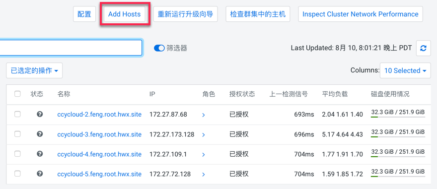
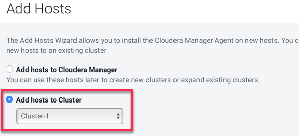
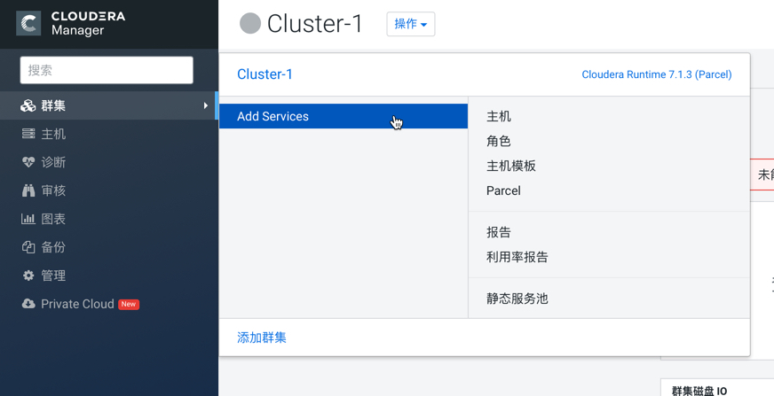
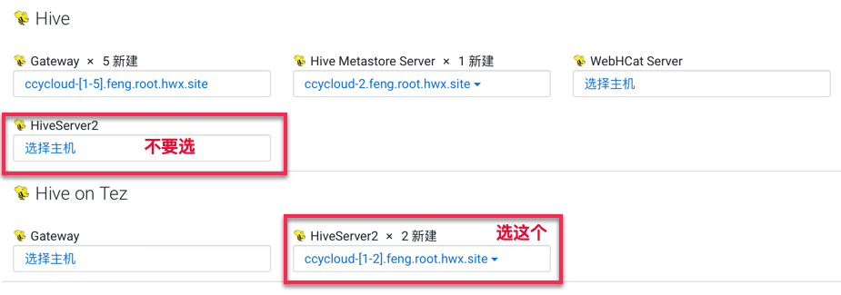
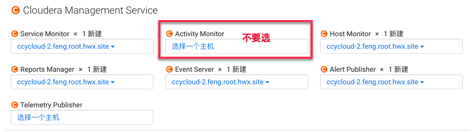

= 安装CDP

**目录**

. <<上传License>> +
. <<安装Cloudera Manager Agent和CDH Parcel>> +
. <<补加节点>> +
. <<添加服务组件>>

== 上传License

如果没有CDP license，可以选择"Try Cloudera Data Platform for 60 days"

image::pictures/CDP001.jpg[license]

== 安装Cloudera Manager Agent和CDH Parcel

=== Step1:给新集群命名

image::pictures/CDP002.jpg[cluster name]

=== Step2:选择目标主机

image::pictures/CDP003.jpg[select hosts]

**注意：** 由于第一台主机已经安装过Cloudera Manager Agent，所以会显示为灰色，后面要补充添加

=== Step3:选择软件包下载地址

image::pictures/CDP005.jpg[select repoistories]

注意：Parcel Repository & Network Settings需要填写cdp7.1.3对应的URL

image::pictures/CDP004.jpg[select repoistories]

=== Step4:由于OpenJDK8已经提前安装好了，所以选择"Manually manage JDK"

image::pictures/CDP006.jpg[select JDK]

=== Step5:填写用户名和密码

image::pictures/CDP007.jpg[password]

=== Step6:安装Cloudera Manager Agent

image::pictures/CDP008.jpg[install Agent]

=== Step7:安装CDH parcel

image::pictures/CDP009.jpg[install parcel]

=== Step8:集群检查（网络性能和主机扫描）

image::pictures/CDP010.jpg[inspector]

网络性能检查：

image::pictures/CDP011.jpg[inspector]

主机整体扫描：

image::pictures/CDP012.jpg[inspector]

== 补加节点

退出当前页面，新开一个页面，必须把第一个节点补加进去。选择"主机"->"Add host":

选择"当前管理的主机"：

image::pictures/CDP014.jpg[Add host]

后面的步骤和前面一模一样。

== 添加服务组件

点击"群集"-> Add Service，重新进入原来的页面

=== Step1：以Data Engineering为例

image::pictures/CDP015.jpg[add services]

=== Step2：角色分配

推荐按照官网指导： 
https://docs.cloudera.com/cloudera-manager/7.1.3/installation/topics/cdpdc-runtime-cluster-hosts-role-assignments.html[参考链接]

各主机角色分配示例如下：

image::pictures/CDP016.jpg[assign roles]

有两个需要注意的地方：

* hiveserver2需要在hive on tez中选择：

* Activity Monitor为MapReduce1服务，不需要选

=== Step3：测试数据库连接

image::pictures/CDP017.jpg[database connection]

=== Step4：输入必要的参数，主要是ranger服务的四个密码设置
....
ranger-keyadmin_user_password = Admin1234
ranger-rangeradmin_user_password = Admin1234
ranger-rangertagsync_user_password = Admin1234
ranger-rangerusersync_user_password = Admin1234
....

image::pictures/CDP018.jpg[setting1]

=== Step5：审核更改，主要是调整Atlas的两个参数

image::pictures/CDP019.jpg[setting2]

=== Step6：在参数设置完毕后，集群首次启动

image::pictures/CDP020.jpg[first run]

=== Step7：启动成功

image::pictures/CDP021.jpg[finish]
