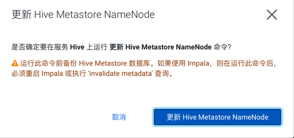

= HA说明

支持HA: 
- HDFS
           
- Zookeeper 
       
- HBase  
          
- Hive  
           
- Yarn  
           
- MapReduce jobs  
 
- Spark jobs  
     
- Oozie  
          
- Hue   
           
- Impala   
        
- Atlas  
          
- Ranger 
          
- RangerKMS 
       
- Kafka  
          
- NiFi  
           
- Knox  
           
- Schema Registry    

- SRM Drivers    
  
- EFM (CEM) 

不支持HA：                                                     
- Cloudera Manager (active-passive fast failover possible)

- Cloudera Management Service  
                           
- CDSW Master Node 
                                       
- Yarn JobHistory Server      
                            
- Spark History Server  
                                  
- Zeppelin 
                                               
- NiFi Registry   
                                        
- SMM     
                                                
- SRM Service  
                                             

= HA设置

== HDFS

=== 配置HDFS HA

Step1.  进入HDFS服务页面，点击"启用High Availability"

Step2.  指定一个Nameservice名称，默认为nameservice1

Step3.	指定NameNode Standby Host和JournalNode Hosts

image::pictures/HA003.jpg[JournalNode Hosts]

Step4.	填写JournalNode Edits Directory，此处设置为/dfs/jn

image::pictures/HA004.jpg[JournalNode Edits Directory]

Step5.	Cloudera Manager执行一系列的命令进行HA配置

Step6.  执行结束，提示Hue和Hive Metastore需要配合HDFS进行配置修改

=== 配置Hive Metastore使用HDFS HA

Step1.  停止Hive服务，然后备份Hive Metastore的数据，即将元数据从MySQL库中导出到一个安全目录。由于本次是初始安装，因此未做备份操作

image::pictures/HA007.jpg[Stop Hive Service]

Step2.  点击更新Hive Metastore NameNodes

Step3.	Cloudera Manager执行一系列的命令进行更新配置，直至执行结束

image::pictures/HA011.jpg[First Run]

=== 配置Hue使用HDFS HA

Step1.  进入HDFS服务页面，进入"实例"标签页面，点击"添加角色实例"

image::pictures/HA012.jpg[Add Role Instances]

Step2.  点击HttpFS角色下面文本框选择主机

image::pictures/HA013.jpg[Add HttpFS]

Step3.  启动HttpFS角色

image::pictures/HA015.jpg[Start HttpFS]

image::pictures/HA016.jpg[Start HttpFS]

Step4.  进入Hue服务页面，进入"配置"标签页面，搜索"HDFS Web"，选中httpfs单选框

Step5.  点击保存修改并重启Hue服务

https://docs.cloudera.com/runtime/7.1.1/fault-tolerance/topics/cr-high-availablity-on-cdp-clusters.html[参考链接]

== YARN 

Step1.  进入YARN服务页面，点击"启用High Availability"

image::pictures/HA018.jpg[Enable High Avaibility]

Step2.  指定Resource Manager Standby Host

image::pictures/HA019.jpg[Resource Manager Standby Host]

Step3.	Cloudera Manager执行一系列的命令进行HA配置，直至执行结束，不需要后续操作

https://docs.cloudera.com/runtime/7.1.1/yarn-high-availability/topics/yarn-resourcemanager-ha-overview.html[参考链接]

== HBase

进入HBase服务页面，进入"实例"标签页面，点击"添加角色实例"，在另一台主机上部署Standby HMaster实例

image::pictures/HA021.jpg[Enable High Avaibility]

https://docs.cloudera.com/runtime/7.1.1/hbase-high-availability/topics/hbase-enable-ha-using-cm.html[参考链接]

== Hue

进入Hue服务页面，进入"实例"标签页面，点击"添加角色实例"，在另一台主机上部署Hue Server实例

image::pictures/HA022.jpg[Enable High Avaibility]

https://docs.cloudera.com/runtime/7.1.1/administering-hue/topics/hue-add-role-instance-with-cm.html[参考链接]

== Hive

进入Hive on Tez服务页面，进入"实例"标签页面，点击"添加角色实例"，在另一台主机上部署Hive Server2实例

image::pictures/HA023.jpg[Enable High Avaibility]

https://docs.cloudera.com/runtime/7.1.1/hive-metastore/topics/hive-hms-introduction.html[参考链接]

== Atlas

进入Atlas服务页面，进入"实例"标签页面，点击"添加角色实例"，在另一台主机上部署Atlas Server实例

image::pictures/HA024.jpg[Enable High Avaibility]

== Oozie

前提是安装好了HAProxy，详见install_full_script.sh部分。

__注意1：如果浏览器是中文语言，Oozie Load Balancer Hostname选项存在bug。必须把浏览器语言切换到英文语言!!!__

__注意2：haproxy.cfg中配置的3个参数：__

[source,bash]
Oozie Load Balancer=ccycloud-1.feng.root.hwx.site
Oozie Load Balancer HTTP Port=11003
Oozie Load Balancer HTTPS Port=11446

Step1.  进入Oozie服务页面，点击"启用High Availability"

image::pictures/HA025.jpg[Enable High Avaibility]

Step2.  指定另一个Oozie Server

填写上述3个参数：

image::pictures/HA027.jpg[Oozie Server Port]

Step3.	Cloudera Manager执行一系列的命令进行HA配置，直至执行结束，不需要后续操作

image::pictures/HA028.jpg[First Run]

https://docs.cloudera.com/runtime/7.1.1/configuring-oozie/topics/oozie-high-availability.html[参考链接]

== Impala

前提是安装好了HAProxy，详见install_full_script.sh部分。

__注意：haproxy.cfg中配置的3个参数：__

[source,bash]
Impala Load Balancer=ccycloud-1.feng.root.hwx.site
Impala Shell Load Balancer Port=21001
Impala JDBC Load Balancer Port=21051

Step1.  进入Hue服务页面，进入"配置"标签页面，搜索"load balancer"，填写为ccycloud-1.feng.root.hwx.site:21001

Step2.  点击保存修改并重启Impala服务

https://docs.cloudera.com/runtime/7.1.1/impala-manage/topics/impala-load-balancer-configure.html[参考链接]

== Hue

前提是安装好了HAProxy，详见install_full_script.sh部分。

需要在hue_safety_valve.ini中，添加以下配置：

[source,bash]
----
[beeswax]
hive_server_host=ccycloud-1.feng.root.hwx.site
hive_server_port=10099

[impala]
server_host=ccycloud-1.feng.root.hwx.site
server_port=21051
----

Step1.  在Hue配置项搜索”hue_safety_valve.ini”，然后添加上述配置

image::pictures/HA030.jpg[hue_safety_valve]

Step2.  点击保存修改并重启Hue服务
