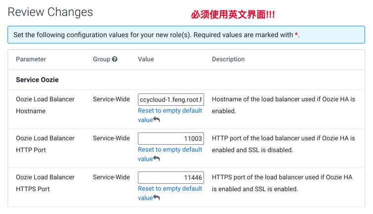

= HA设置

**目录**

. <<HA说明>> +
.. <<支持HA的组件>> +
.. <<不支持HA的组件>>
. <<HDFS>> +
.. <<配置HDFS HA>> +
.. <<配置Hive Metastore使用HDFS HA>>
.. <<配置Hue使用HDFS HA>>
. <<YARN>> +
. <<HBASE>> +
. <<ATLAS>> +
. <<OOZIE>> +
. <<IMPALA>> +
. <<HIVE>> +
. <<HUE>>

== HA说明

=== 支持HA的组件

.支持HA的组件说明

|===
|组件 | 节点部署| 高可用模式

|HDFS
|2个Namenode实例 + 3个Journal node进行editlog同步
|Active-Standby模型，支持自动切换

|Zookeeper
|3个Zookeeper实例
|通过leader选举产生Active节点的模式

|HBase
|3个Hmaster实例
|通过leader选举产生Active节点的模式

|Kudu
|3个Kudu Master实例
|通过leader选举产生Active节点的模式

|Hive
|2个Hive Metastore + 3个Hive Server2
|active-active模式，通过元数据服务器同步信息

|Yarn
|2个ResourceManager实例
|Active-Standby模型，支持自动切换

|MapReduce
|N/A
|由YARN保证

|Spark
|N/A
|由YARN保证

|Oozie
|多个Oozie服务器
|active-active模式，通过元数据服务器同步信息

|Hue
|多个Hue服务器
|active-active模式，通过元数据服务器同步信息

|Atlas
|多个Atlas服务器
|active-active模式

|Impala Daemon
|在前端服务器中配置Load Balancer
|由Load Balancer保障

|Cloudera Manager/Cloudera Management Service
|2个Cloudera Manager Server和Cloudera Management Service实例
|由Load Balancer保障

|Ranger
|
|

|RangerKMS
|
|

|Kafka
|
|

|NiFi
|
|

|Knox
|
|

|Schema Registry
|
|

|SRM Drivers
|
|

|EFM (CEM)
|
|

|===

=== 不支持HA的组件

.不支持HA的组件说明

|===
|组件 | 故障影响| 恢复步骤

|

|
|
|

|CDSW Master Node
|导致CDSW服务不可用
|如果CDSW项目有备份，则可以重建Master Node。建议安装另一个CDSW Master做冷备

|Yarn JobHistory Server
|提供了一个用户界面，用来访问运行完成的MapReduce作业的YARN日志。由于日志保存在HDFS中，因此没有数据丢失，只不过不能通过UI来查看
|发生故障之后，另建一个Job History Server实例非常简单

|Spark History Server
|提供了一个用户界面，用来访问运行完成的Spark EventLog。由于日志保存在HDFS中，因此没有数据丢失，只不过不能通过UI来查看
|发生故障之后，另建一个Spark History Server实例非常简单

|Impala Catalogd/StateStore
|无法执行Impala查询语句
|通过CM删除失败节点，将服务重新添加到新节点上，并且重启Impala与Hue服务

|Zeppelin
|
|

|NiFi Registry
|
|

|SMM
|
|

|SRM Service
|
|

|===

== HDFS

=== 配置HDFS HA

Step1.  进入HDFS服务页面，点击"启用High Availability"

image::pictures/HA001.jpg[Enable High Availability]

Step2.  指定一个Nameservice名称，默认为nameservice1

image::pictures/HA002.jpg[nameservice1]

Step3.	指定NameNode Standby Host和JournalNode Hosts

Step4.	填写JournalNode Edits Directory，此处设置为/dfs/jn

image::pictures/HA004.jpg[JournalNode Edits Directory]

Step5.	Cloudera Manager执行一系列的命令进行HA配置

image::pictures/HA005.jpg[First Run]

Step6.  执行结束，提示Hue和Hive Metastore需要配合HDFS进行配置修改

image::pictures/HA006.jpg[Final Step]

=== 配置Hive Metastore使用HDFS HA

Step1.  停止Hive服务，然后备份Hive Metastore的数据，即将元数据从MySQL库中导出到一个安全目录。由于本次是初始安装，因此未做备份操作

image::pictures/HA008.jpg[Stop Hive Service]

Step2.  点击更新Hive Metastore NameNodes

image::pictures/HA009.jpg[Update Hive Metastore NameNodes]

image::pictures/HA010.jpg[Update Hive Metastore NameNodes]

Step3.	Cloudera Manager执行一系列的命令进行更新配置，直至执行结束

=== 配置Hue使用HDFS HA

Step1.  进入HDFS服务页面，进入"实例"标签页面，点击"添加角色实例"

Step2.  点击HttpFS角色下面文本框选择主机

image::pictures/HA014.jpg[Add HttpFS]

Step3.  启动HttpFS角色

image::pictures/HA016.jpg[Start HttpFS]

Step4.  进入Hue服务页面，进入"配置"标签页面，搜索"HDFS Web"，选中httpfs单选框

image::pictures/HA017.jpg[Select HttpFS]

Step5.  点击保存修改并重启Hue服务

https://docs.cloudera.com/runtime/7.1.1/fault-tolerance/topics/cr-high-availablity-on-cdp-clusters.html[参考链接]

== YARN

Step1.  进入YARN服务页面，点击"启用High Availability"

Step2.  指定Resource Manager Standby Host

Step3.	Cloudera Manager执行一系列的命令进行HA配置，直至执行结束，不需要后续操作

image::pictures/HA020.jpg[First Run]

https://docs.cloudera.com/runtime/7.1.1/yarn-high-availability/topics/yarn-resourcemanager-ha-overview.html[参考链接]

== HBASE

进入HBase服务页面，进入"实例"标签页面，点击"添加角色实例"，在另一台主机上部署Standby HMaster实例

image::pictures/HA021.jpg[Enable High Avaibility]

https://docs.cloudera.com/runtime/7.1.1/hbase-high-availability/topics/hbase-enable-ha-using-cm.html[参考链接]

== ATLAS

进入Atlas服务页面，进入"实例"标签页面，点击"添加角色实例"，在另一台主机上部署Atlas Server实例

== OOZIE

前提是安装好了HAProxy，详见link:install_full_script.sh[install_full_script.sh]部分。

__注意1：如果浏览器是中文语言，Oozie Load Balancer Hostname选项存在bug。必须把浏览器语言切换到英文语言!!!__

__注意2：haproxy.cfg中配置的3个参数：__
....
Oozie Load Balancer=ccycloud-1.feng.root.hwx.site
Oozie Load Balancer HTTP Port=11003
Oozie Load Balancer HTTPS Port=11446
....

Step1.  进入Oozie服务页面，点击"启用High Availability"

Step2.  指定另一个Oozie Server

image::pictures/HA026.jpg[Oozie Server Host]

填写上述3个参数：

Step3.	Cloudera Manager执行一系列的命令进行HA配置，直至执行结束，不需要后续操作

https://docs.cloudera.com/runtime/7.1.1/configuring-oozie/topics/oozie-high-availability.html[参考链接]

== IMPALA

前提是安装好了HAProxy，详见link:install_full_script.sh[install_full_script.sh]部分。

__注意：haproxy.cfg中配置的3个参数：__

....
Impala Load Balancer=ccycloud-1.feng.root.hwx.site
Impala Shell Load Balancer Port=21001
Impala JDBC Load Balancer Port=21051
....

Step1.  进入Impala服务页面，进入"配置"标签页面，搜索"load balancer"，填写为ccycloud-1.feng.root.hwx.site:21001

image::pictures/HA029.jpg[load balancer]

Step2.  点击保存修改并重启Impala服务

https://docs.cloudera.com/runtime/7.1.1/impala-manage/topics/impala-load-balancer-configure.html[参考链接]

== HIVE

Step1.  进入Hive on Tez服务页面，进入"实例"标签页面，点击"添加角色实例"，在另一台主机上部署Hive Server2实例

image::pictures/HA023.jpg[Enable High Avaibility]

https://docs.cloudera.com/runtime/7.1.1/hive-metastore/topics/hive-hms-introduction.html[参考链接]

Step2.  前提是安装好了HAProxy，详见link:install_full_script.sh[install_full_script.sh]部分。

__注意：haproxy.cfg中配置的2个参数：__

....
Hive Load Balancer=ccycloud-1.feng.root.hwx.site
Hive JDBC Load Balancer Port=10099
....

进入Hive服务页面，进入"配置"标签页面，搜索"load balancer"，填写为ccycloud-1.feng.root.hwx.site:10099

Step3.  点击保存修改并重启Hive服务

== HUE

Step1.  进入Hue服务页面，进入"实例"标签页面，点击"添加角色实例"，在另一台主机上部署Hue Server实例

https://docs.cloudera.com/runtime/7.1.1/administering-hue/topics/hue-add-role-instance-with-cm.html[参考链接]

Step2.  前提是安装好了HAProxy，详见link:install_full_script.sh[install_full_script.sh]部分。

需要在hue_safety_valve.ini中，添加以下配置：

....
[beeswax]
hive_server_host=ccycloud-1.feng.root.hwx.site
hive_server_port=10099

[impala]
server_host=ccycloud-1.feng.root.hwx.site
server_port=21051
....

在Hue配置项搜索”hue_safety_valve.ini”，然后添加上述配置

Step3.  点击保存修改并重启Hue服务
