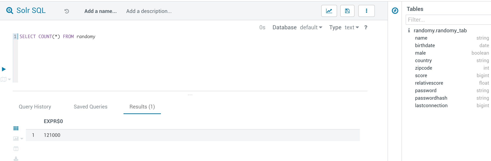

= 测试代码（验证各组件是否正常）

== HDFS

/data目录下存放了多个CSV文件（2018年法国交通事故统计表）。

[source,bash]

# 以root用户登录节点feng-1

```sudo -u hdfs hdfs dfs -mkdir /data
sudo -u hdfs hdfs dfs -chmod 777 /data
sudo -u hdfs hdfs dfs -chown etl_user:hadoop /data```


```su - etl_user
hdfs dfs -mkdir /data/caracteristiques
hdfs dfs -mkdir /data/lieux
hdfs dfs -mkdir /data/usagers
hdfs dfs -mkdir /data/vehicules
hdfs dfs -put lieux-2018.csv /data/lieux/
hdfs dfs -put usagers-2018.csv /data/usagers/
hdfs dfs -put vehicules-2018.csv /data/vehicules/
hdfs dfs -put caracteristiques-2018.csv /data/caracteristiques```


== Hive

[source,bash]
----

# 以root用户登录节点feng-1

beeline -n etl_user -p xxxx <<EOF

CREATE DATABASE accidents;
USE accidents;

CREATE EXTERNAL TABLE IF NOT EXISTS carac_csv
(Num_Acc BIGINT,an STRING,mois STRING,jour STRING,hrmn STRING,lum INT,agg INT,inter INT,atm INT,col INT,com STRING,adr STRING,gps STRING,lat INT,longi INT,dep INT)
ROW FORMAT DELIMITED
FIELDS TERMINATED BY ','
STORED AS TEXTFILE
LOCATION 'hdfs:///data/caracteristiques/'
TBLPROPERTIES ("skip.header.line.count"="1");

CREATE TABLE IF NOT EXISTS carac (Num_Acc BIGINT,an STRING,mois STRING,jour STRING,hrmn STRING,lum INT,agg INT,inter INT,atm INT,col INT,com STRING,adr STRING,gps STRING,lat INT,longi INT,dep INT);

INSERT INTO carac SELECT * FROM carac_csv;


CREATE EXTERNAL TABLE IF NOT EXISTS lieux_csv
(Num_Acc BIGINT, catr INT,voie INT,v1 INT,v2 STRING,circ INT,nbv INT,pr INT,pr1 INT,vosp INT,prof INT,plan INT,lartpc INT,larrout INT,surf INT,infra INT,situ INT,env1 INT)
ROW FORMAT DELIMITED
FIELDS TERMINATED BY ','
STORED AS TEXTFILE
LOCATION 'hdfs:///data/lieux/'
TBLPROPERTIES ("skip.header.line.count"="1");

CREATE TABLE IF NOT EXISTS lieux (Num_Acc BIGINT, catr INT,voie INT,v1 INT,v2 STRING,circ INT,nbv INT,pr INT,pr1 INT,vosp INT,prof INT,plan INT,lartpc INT,larrout INT,surf INT,infra INT,situ INT,env1 INT);

INSERT INTO lieux SELECT * FROM lieux_csv;


CREATE EXTERNAL TABLE IF NOT EXISTS usagers_csv
(Num_Acc BIGINT, place INT,catu INT,grav INT,sexe INT,trajet INT,secu INT,locp INT,actp INT,etatp INT,an_nais INT,num_veh STRING)
ROW FORMAT DELIMITED
FIELDS TERMINATED BY ','
STORED AS TEXTFILE
LOCATION 'hdfs:///data/usagers/'
TBLPROPERTIES ("skip.header.line.count"="1");

CREATE TABLE IF NOT EXISTS usagers (Num_Acc BIGINT, place INT,catu INT,grav INT,sexe INT,trajet INT,secu INT,locp INT,actp INT,etatp INT,an_nais INT,num_veh STRING);

INSERT INTO usagers SELECT * FROM usagers_csv;


CREATE EXTERNAL TABLE IF NOT EXISTS vehicules_csv
(Num_Acc BIGINT, senc INT,catv INT,occutc INT,obs INT,obsm INT,choc INT,manv INT,num_veh STRING)
ROW FORMAT DELIMITED
FIELDS TERMINATED BY ','
STORED AS TEXTFILE
LOCATION 'hdfs:///data/vehicules/'
TBLPROPERTIES ("skip.header.line.count"="1");

CREATE TABLE IF NOT EXISTS vehicules (Num_Acc BIGINT, senc INT,catv INT,occutc INT,obs INT,obsm INT,choc INT,manv INT,num_veh STRING);

INSERT INTO vehicules SELECT * FROM vehicules_csv;

EOF
----

== Impala/Kudu

建立一张kudu表，然后插入数据

[source,bash]
----

# 以root用户登录节点feng-1

impala-shell -i feng-3 << EOF

CREATE DATABASE impala_kudu;

CREATE TABLE IF NOT EXISTS impala_kudu.usagers 
(Num_Acc BIGINT, place INT,catu INT,grav INT,sexe INT,trajet INT,secu INT,locp INT,actp INT,etatp INT,an_nais INT,
num_veh STRING,
PRIMARY KEY(Num_Acc))
PARTITION BY HASH PARTITIONS 16
STORED AS kudu;

INSERT INTO impala_kudu.usagers SELECT * FROM accidents.usagers_csv;

EOF
----

== Kafka


[source,bash]
----

# 以root用户登录节点feng-1

export KAFKA_ZNODE=/kafka
export KAFKA_TOPIC=mytopic
export KAFKA_BROKERS=ccycloud-3.feng.root.hwx.site:9092,ccycloud-4.feng.root.hwx.site:9092,ccycloud-5.feng.root.hwx.site:9092
export KAFKA_BOOTSTRAP_BROKER=$(echo ${KAFKA_BROKERS} | awk -F',' '{print $1}')
export KAFKA_CONSUMER_GROUP=myconsumergroup
export ZOOKEEPER_QUORUM=ccycloud-1.feng.root.hwx.site:2181,ccycloud-2.feng.root.hwx.site:2181,ccycloud-3.feng.root.hwx.site:2181

kafka-topics --list --zookeeper ${ZOOKEEPER_QUORUM}${KAFKA_ZNODE}

kafka-topics --create --zookeeper ${ZOOKEEPER_QUORUM}${KAFKA_ZNODE} --topic ${KAFKA_TOPIC} --replication-factor 1 --partitions 1

kafka-topics --describe --zookeeper ${ZOOKEEPER_QUORUM}${KAFKA_ZNODE} --topic ${KAFKA_TOPIC}

while true; do echo "$(( RANDOM % 10 )),$(echo ${RANDOM} | tr '[0-9]' '[a-zA-Z]')"; sleep 5; done | kafka-console-producer --broker-list ${KAFKA_BROKERS} --topic ${KAFKA_TOPIC}

kafka-console-consumer --bootstrap-server ${KAFKA_BOOTSTRAP_BROKER} --topic ${KAFKA_TOPIC} --from-beginning --group ${KAFKA_CONSUMER_GROUP}

kafka-consumer-groups  --describe --group ${KAFKA_CONSUMER_GROUP} --bootstrap-server ${KAFKA_BOOTSTRAP_BROKER} 

----

== Hbase

[source,bash]
----

# 以root用户登录节点feng-1

sudo -u hbase hbase ltt -tn test -write 1:10:10 -num_keys 100
sudo -u hbase hbase shell << EOF
list
describe 'test'
count 'test'
list_regions 'test'
EOF

----


== SolR

In Java Program:

[source,bash]
----
HttpSolrClient httpSolrClient = new HttpSolrClient.Builder("http://"+PropertiesLoader.properties.getProperty("solr.server.url")+":"+
                PropertiesLoader.properties.getProperty("solr.server.port")+"/solr")
                .withConnectionTimeout(10000)
                .withSocketTimeout(60000)
                .build();


// Create SolR collection
 try {
     httpSolrClient.request(
             CollectionAdminRequest.createCollection(PropertiesLoader.properties.getProperty("solr.collection"),
                     Integer.valueOf(PropertiesLoader.properties.getProperty("solr.collection.shards")),
                     Integer.valueOf(PropertiesLoader.properties.getProperty("solr.collection.replicas")))
     );
 } catch(HttpSolrClient.RemoteSolrException e) {
     if(e.getMessage().contains("collection already exists")) {
         logger.warn("Collection already exists so it has not been created");
     } else {
         logger.error("Could not create SolR collection : " + PropertiesLoader.properties.getProperty("solr.collection")
                 + " due to error: ", e);
     }
 } catch (Exception e) {
     logger.error("Could not create SolR collection : " + PropertiesLoader.properties.getProperty("solr.collection")
             + " due to error: ", e);
 }
 // Set base URL directly to the collection, note that this is required
httpSolrClient.setBaseURL("http://"+PropertiesLoader.properties.getProperty("solr.server.url")+":"+
         PropertiesLoader.properties.getProperty("solr.server.port")+"/solr/"+PropertiesLoader.properties.getProperty("solr.collection"));

SolrInputDocument doc = new SolrInputDocument();
doc.addField("Value", row.toCSVString());

try {
    httpSolrClient.add(doc);
    httpSolrClient.commit();
} catch (Exception e) {
    logger.error("An unexpected error occurred while adding document: " + row.toString() + " to SolR collection : " +
            PropertiesLoader.properties.getProperty("solr.collection") + " due to error:", e);
}

httpSolrClient.close();
----

== Ozone

Using CLI:

[source,bash]
ozone sh volume create /test
ozone sh bucket create /test/bucket1
ozone sh key put /test/bucket1/hoster /etc/hosts
ozone sh key list /test/bucket1


Using Java Program:

[source,bash]
----
ozClient = OzoneClientFactory.getRpcClient(PropertiesLoader.properties.getProperty("ozone.om.uri"),
            Integer.valueOf(PropertiesLoader.properties.getProperty("ozone.om.port")));
objectStore = ozClient.getObjectStore();

// Create volume if not exists
     try {
    objectStore.createVolume(PropertiesLoader.properties.getProperty("ozone.volume.name"));
} catch (OMException e) {
    if(e.getResult() == OMException.ResultCodes.VOLUME_ALREADY_EXISTS) {
        logger.info("Volume: " + PropertiesLoader.properties.getProperty("ozone.volume.name") + " already exists ");
    } else {
        logger.error("An error occurred while creating volume " +
                PropertiesLoader.properties.getProperty("ozone.volume.name") + " : ", e);
    }
} catch (IOException e) {
    logger.error("An unexpected exception occurred while creating volume " +
            PropertiesLoader.properties.getProperty("ozone.volume.name") + ": ", e);
}

volume = objectStore.getVolume(PropertiesLoader.properties.getProperty("ozone.volume.name"));

// Create bucket if not exists
String bucketName = PropertiesLoader.properties.getProperty("ozone.bucket.prefix") + bucketNumber; 
volume.createBucket(bucketName);
OzoneBucket bucket = volume.getBucket(bucketName);

Random random = new Random();
byte[] blob = new byte[1_000_000];
random.nextBytes(blob);
OzoneOutputStream os = bucket.createKey(name+birthdate+country, blob.length);
os.write(blob);
os.close();

----


= 

== HDFS



[source,bash]
----
[frisch@cdp-test-1 ~]$ hdfs dfs -ls -h /user/frisch
Found 1 items
-rw-r--r--   3 frisch supergroup      2.6 M 2020-03-30 00:18 /user/frisch/randomy.csv
----

== Hive

Insertion is working well but is very very very slow... :

image::pictures/HiveHueResultsRandomy_tab.png[Hive results from Hue]

== Impala/Kudu


== Kafka

Kafka insertions actually works in console on the cluster, but not with Java, it seems something is not working with Java (maybe Java dependencies).

jaas.config:
[source,bash]
----
KafkaClient {
    com.sun.security.auth.module.Krb5LoginModule required
    useKeyTab=true
    storeKey=true
    useTicketCache=true
    keyTab="/home/frisch/frisch.keytab"
    principal="frisch@FRISCH.COM";
};
----

producer.properties:
[source,bash]
bootstrap.servers=cdp-test-4.gce.cloudera.com:9093
security.protocol=SASL_SSL
ssl.truststore.location=/opt/cloudera/security/pki/truststore.jks
ssl.truststore.password=cloudera
ssl.keystore.location=/opt/cloudera/security/pki/keystore.jks
ssl.keystore.password=cloudera
ssl.key.password=cloudera
sasl.mechanism=GSSAPI
sasl.kerberos.service.name=kafka

[source,bash]
export KAFKA_OPTS="-Djava.security.auth.login.config=/opt/cloudera/parcels/CDH/lib/kafka/bin/jaas.config"

[source,bash]
----
cd /opt/cloudera/parcels/CDH/lib/kafka/bin/
kafka-console-producer --broker-list cdp-test-4.gce.cloudera.com:9093 --topic test --producer.config producer.properties

....

20/03/30 02:08:16 INFO kerberos.KerberosLogin: [Principal=frisch@FRISCH.COM]: TGT refresh thread started.
20/03/30 02:08:16 INFO kerberos.KerberosLogin: [Principal=frisch@FRISCH.COM]: TGT valid starting at: Mon Mar 30 02:08:16 PDT 2020
20/03/30 02:08:16 INFO kerberos.KerberosLogin: [Principal=frisch@FRISCH.COM]: TGT expires: Tue Mar 31 02:08:16 PDT 2020
20/03/30 02:08:16 INFO kerberos.KerberosLogin: [Principal=frisch@FRISCH.COM]: TGT refresh sleeping until: Mon Mar 30 21:53:23 PDT 2020
20/03/30 02:08:16 INFO utils.AppInfoParser: Kafka version: 2.3.0.7.0.3.0-79
20/03/30 02:08:16 INFO utils.AppInfoParser: Kafka commitId: 7df36e7ddd0676a5
20/03/30 02:08:16 INFO utils.AppInfoParser: Kafka startTimeMs: 1585559296554
>20/03/30 02:08:16 INFO clients.Metadata: [Producer clientId=console-producer] Cluster ID: DzlLGaw2R7ywvGOsKwZ3PA
scbvqhjc
20/03/30 02:08:20 WARN clients.NetworkClient: [Producer clientId=console-producer] Error while fetching metadata with correlation id 3 : {test=LEADER_NOT_AVAILABLE}
>dcs
>csd
>cs
>csd

----

[source,bash]
----
cd /opt/cloudera/parcels/CDH/lib/kafka/bin/
kafka-console-consumer.sh --bootstrap-server cdp-test-4.gce.cloudera.com:9093 --topic test --consumer.config consumer.properties --from-beginning

....

20/03/30 02:08:31 INFO internals.ConsumerCoordinator: [Consumer clientId=consumer-1, groupId=console-consumer-507] Revoking previously assigned partitions []
20/03/30 02:08:31 INFO internals.AbstractCoordinator: [Consumer clientId=consumer-1, groupId=console-consumer-507] (Re-)joining group
20/03/30 02:08:31 INFO internals.AbstractCoordinator: [Consumer clientId=consumer-1, groupId=console-consumer-507] (Re-)joining group
20/03/30 02:08:34 INFO internals.AbstractCoordinator: [Consumer clientId=consumer-1, groupId=console-consumer-507] Successfully joined group with generation 1
20/03/30 02:08:34 INFO internals.ConsumerCoordinator: [Consumer clientId=consumer-1, groupId=console-consumer-507] Setting newly assigned partitions: test-0
20/03/30 02:08:34 INFO internals.ConsumerCoordinator: [Consumer clientId=consumer-1, groupId=console-consumer-507] Found no committed offset for partition test-0
20/03/30 02:08:34 INFO internals.SubscriptionState: [Consumer clientId=consumer-1, groupId=console-consumer-507] Resetting offset for partition test-0 to offset 0.
scbvqhjc
dcs
csd
cs
csd
----

== HBase

Insertion is working well:

[source,bash]
----
hbase(main):001:0> list
TABLE                                                                                                                                                                        
ATLAS_ENTITY_AUDIT_EVENTS                                                                                                                                                    
atlas_janus                                                                                                                                                                  
randomy                                                                                                                                                                      
test1                                                                                                                                                                        
4 row(s)
Took 0.8724 seconds                                                                                                                                                          
=> ["ATLAS_ENTITY_AUDIT_EVENTS", "atlas_janus", "randomy", "test1"]
hbase(main):002:0> count 'randomy'
Current count: 140000, row: Zuzana2019-01-27Mali                                                                                                                             
140000 row(s)
Took 15.2539 seconds                                                                                                                                                         
=> 140000
hbase(main):003:0> 
----


== SolR

Insertion is working well:




== Ozone

Insertion is working well:

[source,bash]
----
[frisch@cdp-test-1 ~]$ ozone sh volume list /
{
  "metadata" : { },
  "name" : "randomy",
  "admin" : "frisch@FRISCH.COM",
  "owner" : "frisch@FRISCH.COM",
  "creationTime" : 1585552623861,
  "acls" : [ {
    "type" : "USER",
    "name" : "frisch@FRISCH.COM",
    "aclScope" : "ACCESS",
    "aclList" : [ "ALL" ]
  }, {
    "type" : "GROUP",
    "name" : "frisch",
    "aclScope" : "ACCESS",
    "aclList" : [ "ALL" ]
  } ],
  "quota" : 1152921504606846976
}
----


= UI

Goal is to login to all UIs and ensure everything is working.

== Hue

username: admin
password: admin

== Ranger

username: admin
password: Admin1234

== Atlas

username: admin
password: Admin1234


== PSQL Database

username: postgres  
password: admin


== Other UIs

Does not need any password and function well with no Kerberos (SPNEGO) activated yet

