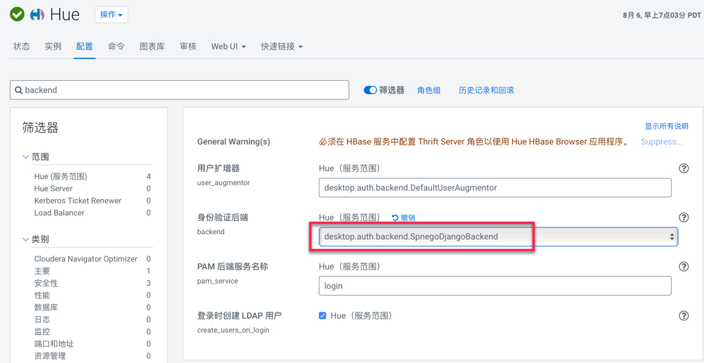
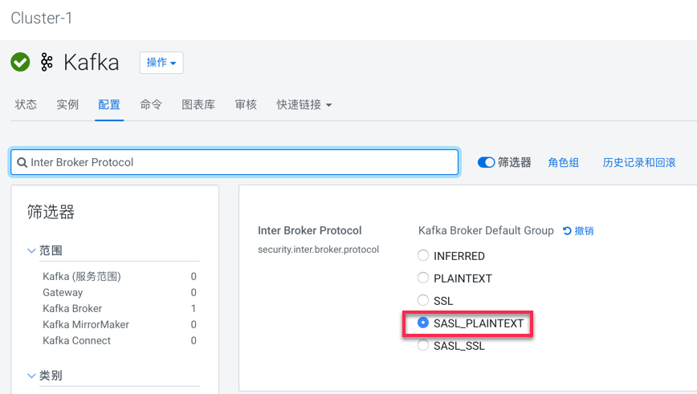
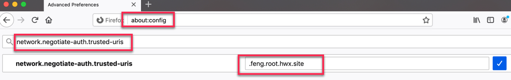

= 安全管理三步曲

- 身份认证：Kerberos

- 权限管控：Ranger

- 加密：TLS/SSL + HDFS Transparent Encryption

image::pictures/SEC001.png[license]

= 启用Kerberos

**目录**

. <<通过CM安全向导启用Kerberos>> +
. <<Hue激活SPNEGO>> +
. <<kafka修改inter Broker Protocol>> +
. <<通过客户端访问UI>> +
.. <<1.检查UI是否需要配置SPNEGO>> +
.. <<2.获取有效凭证>> +
.. <<3.对浏览器设置SPNEGO认证>>

前提是安装好了krb5-server/krb5-workstation，详见link:install_full_script.sh[install_full_script.sh]部分。

== 通过CM安全向导启用Kerberos
Step1.  进入Cloudera Manager的“管理”-> “安全”界面

image::pictures/SEC002.jpg[Security Entry]

Step2.  进入如下界面，选择“启用Kerberos”

image::pictures/SEC003.jpg[Kerberos Page]

Step3.  选择KDC服务类型，已经确保KDC服务是否已启动且准备好

image::pictures/SEC004.jpg[MIT KDC]

Step4.  点击“继续”，配置相关的KDC信息，包括KDC服务器、KDC Realm、加密类型以及待创建的Service Principal的更新生命期等

image::pictures/SEC005.jpg[Configruation]

Step5.  不建议让Cloudera Manager来管理krb5.conf，点击继续

image::pictures/SEC006.jpg[Skip CM]

Step6.  输入Cloudera Manager的Kerbers管理员账号，一定得和之前创建的账号一致，点击“继续”

image::pictures/SEC007.jpg[Cloudera-scm]

Step7.  点击“继续”，导出KDC Account Manager凭据

image::pictures/SEC008.jpg[KDC Account Manager]

Step8.  确认Kerberos信息以及HDFS的端口号的变化（默认即可）

image::pictures/SEC009.jpg[KDC Port]

Step9.  点击“继续”，运行启用Kerberos命令

image::pictures/SEC010.jpg[First Run]

Step10.  点击“完成”，至此已成功启用Kerberos。

image::pictures/SEC011.jpg[Final Step]

Step11.  查看CM上显示集群已启用Kerberos

image::pictures/SEC012.jpg[Successful]

https://docs.cloudera.com/cloudera-manager/7.1.1/security-kerberos-authentication/topics/cm-security-kerberos-enabling-intro.html[参考链接] 

== Hue激活SPNEGO

Step1.  进入Hue服务页面，进入"配置"标签页面，搜索"backend"，选中"desktop.auth.backend.SpnegoDjangoBackend"

Step2.  点击保存修改并重启Hue服务

== kafka修改inter Broker Protocol

Step1.  修改security.inter.broker.protocol配置为SASL_PLAINTEXT

Step2.  点击保存修改并重启Kafka服务

== 通过客户端访问UI

启用Kerberos后，几乎所有UI都被kerberized，这意味着SPNEGO被激活，外部应用只能拥有的有效keytab才能访问UI。

=== 1.检查UI是否需要配置SPNEGO

.SPNEGO

|===
|组件 | 是否需要SPNEGO|无ticket时的报错信息

|ATLAS
|No
|N/A

|HBase
|No
|N/A

|Namenode
|Yes
|Error: HTTP ERROR 401 Unauthorized access

|HiveServer2
|No
|N/A

|HUE
|Yes
|401 Unauthorized

|Impala
|Yes
|Error: Must authenticate with SPNEGO.

|Kudu
|Yes
|Error: Must authenticate with SPNEGO.

|Oozie
|Yes
|"errorMessage":"Unauthorized access","httpStatusCode":401

|Ranger
|No
|N/A

|Spark
|No
|N/A

|YARN RM & JobHistory
|Yes
|Error: HTTP ERROR 401 Unauthorized access

|DAS
|Yes
|Error: HTTP ERROR 401 Unauthorized access

|Solr
|Yes
|Error: HTTP ERROR 401 WWW-Authenticate: Negotiate
|===

=== 2.获取有效凭证

从集群中下载__krb5.conf__和__etl_user.keytab__。

一旦在本地计算机上安装了Kerberos，就能使用以下方法进行身份验证：
....
     kinit -kt tools/etl_user.keytab etl_user/ccycloud-1.feng.root.hwx.site@FENG.COM
....
    
=== 3.对浏览器设置SPNEGO认证

以Firefox为例：

Step1.  切入about:config页面，在搜索栏输入network.negotiate-auth.trusted-uris，然后填写主机通用后缀.feng.root.hwx.site 

Step2.  重启Firfox
