= 安全管理三步曲 
- kerberos +
- Ranger +
- TLS/SSL + HDFS Transparent Encryption

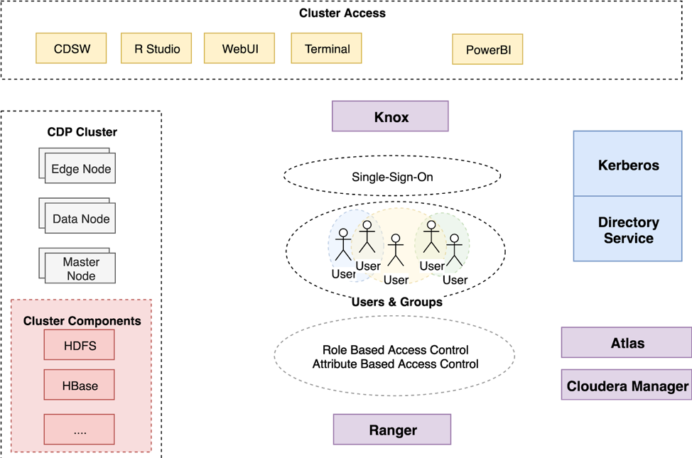

= Kerberos

前提是安装好了krb5-server，详见install_full_script.sh部分。
然后将KDC server的krb5.conf同步到其他主机。

[source,bash]
scp tools/krb5.conf root@feng-2:/etc/krb5.conf
scp tools/krb5.conf root@feng-3:/etc/krb5.conf
scp tools/krb5.conf root@feng-4:/etc/krb5.conf
scp tools/krb5.conf root@feng-5:/etc/krb5.conf

== 通过CM安全向导启用Kerberos
Step1.  进入Cloudera Manager的“管理”-> “安全”界面

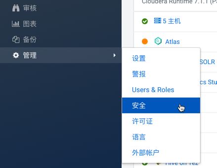

Step2.  进入如下界面，选择“启用Kerberos”

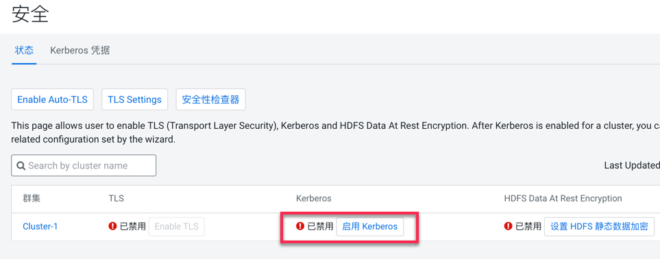

Step3.  选择KDC服务类型，已经确保KDC服务是否已启动且准备好

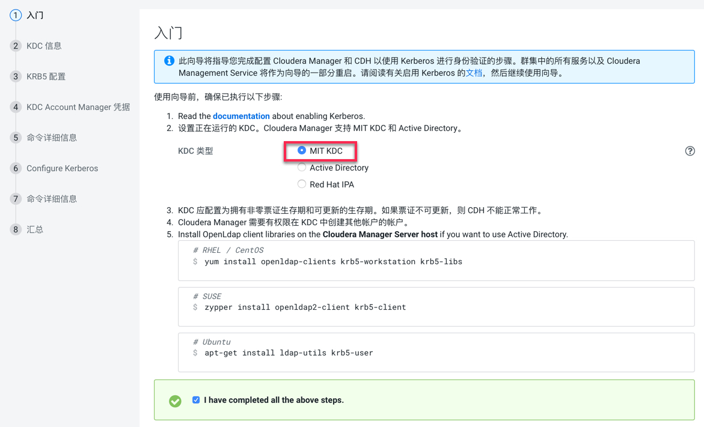

Step4.  点击“继续”，配置相关的KDC信息，包括KDC服务器、KDC Realm、加密类型以及待创建的Service Principal的更新生命期等

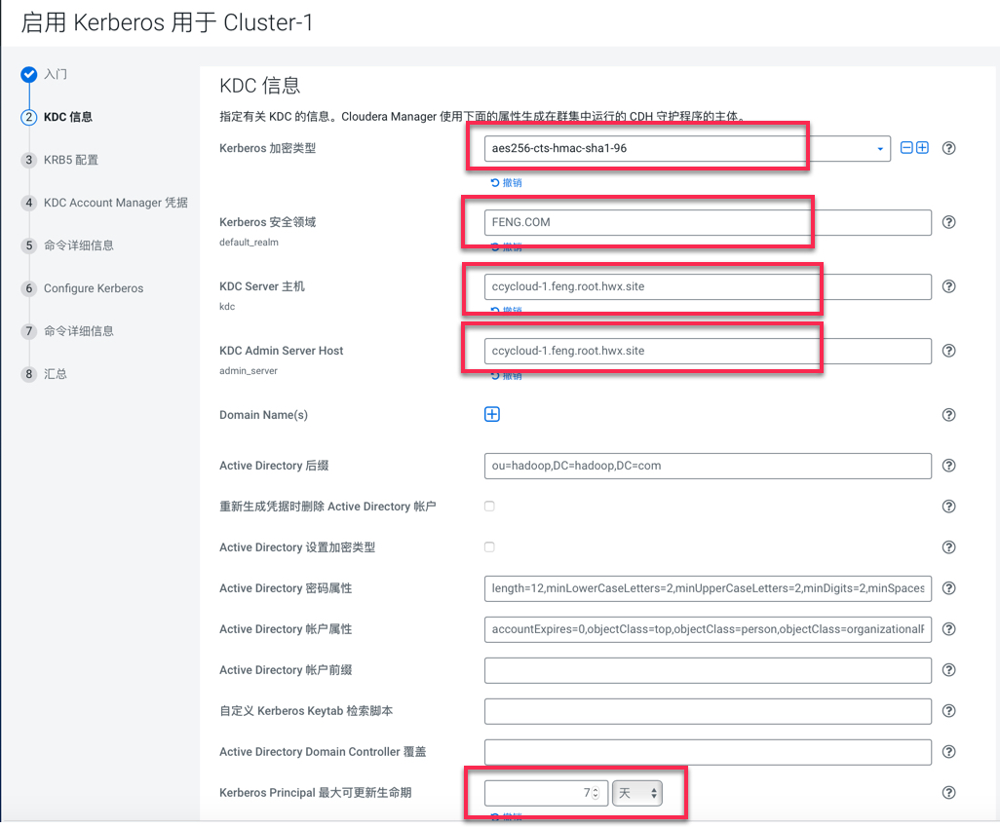

Step5.  不建议让Cloudera Manager来管理krb5.conf，点击继续

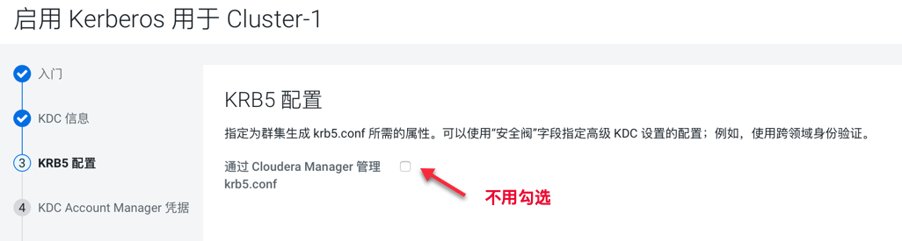

Step6.  输入Cloudera Manager的Kerbers管理员账号，一定得和之前创建的账号一致，点击“继续”

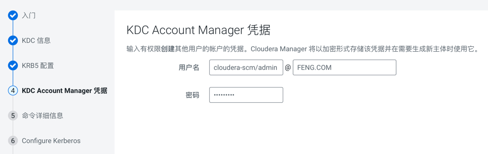

Step7.  点击“继续”，导出KDC Account Manager凭据

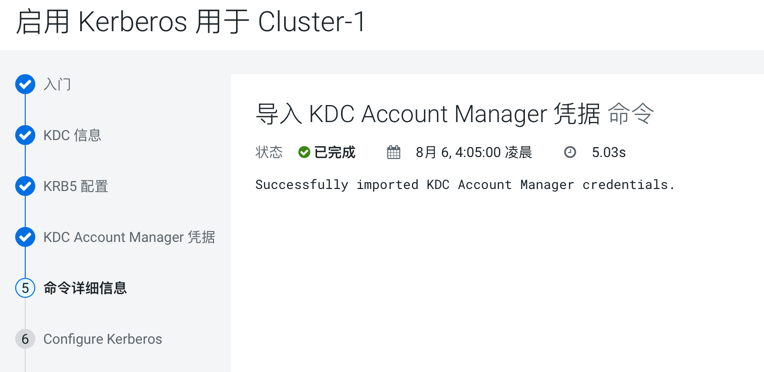

Step8.  确认Kerberos信息以及HDFS的端口号的变化（默认即可）

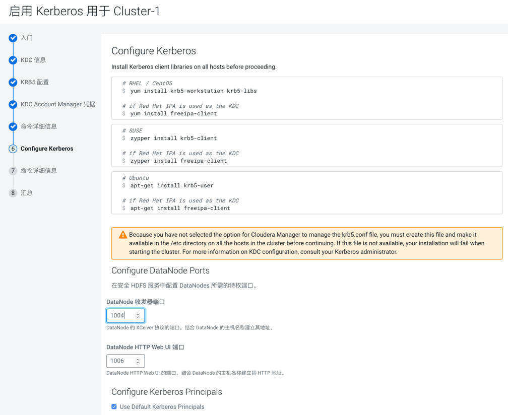

Step9.  点击“继续”，运行启用Kerberos命令

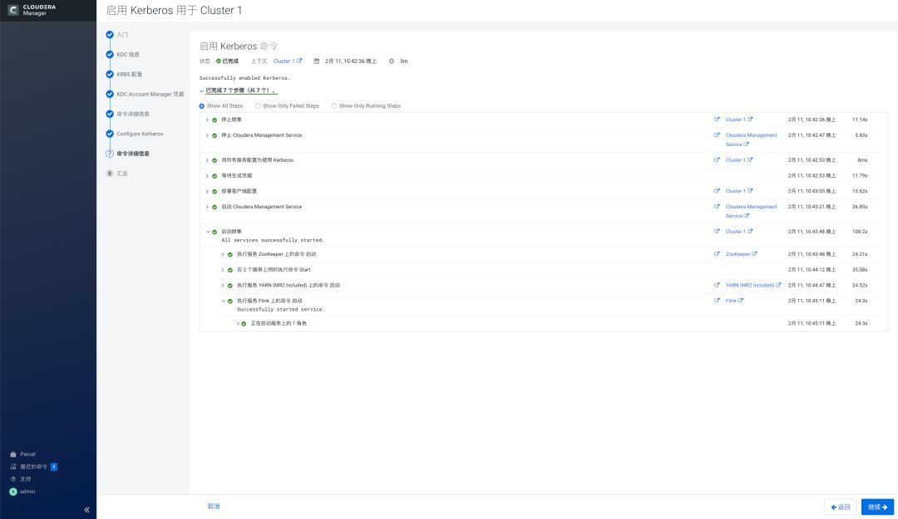

Step11.  点击“完成”，至此已成功启用Kerberos。

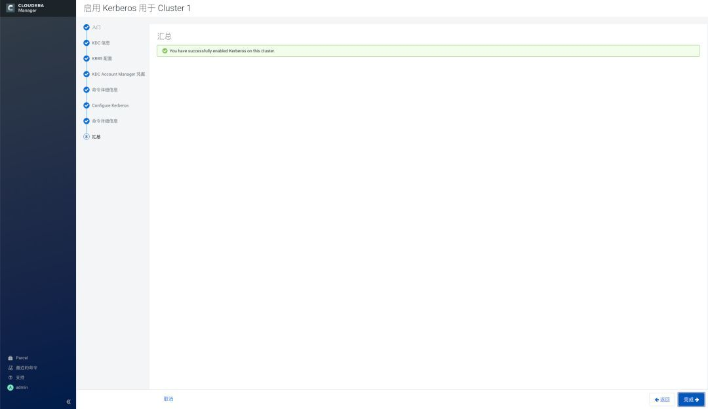

Step12.  查看CM上显示集群已启用Kerberos

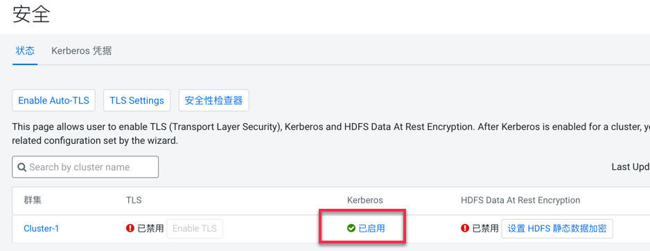

https://docs.cloudera.com/cloudera-manager/7.1.1/security-kerberos-authentication/topics/cm-security-kerberos-enabling-intro.html[参考链接] 

=== YARN state store must be formatted

As YARN was already in HA, its zookeeper znode must be erased and rebuild later, with kerberos enabled.

- Stop of YARN services

- "Format State Store" (see image below)

image::pictures/formatStateStore.png[Format YARN State Store]

=== Go through wizard

Administration > Security > Enable Kerberos

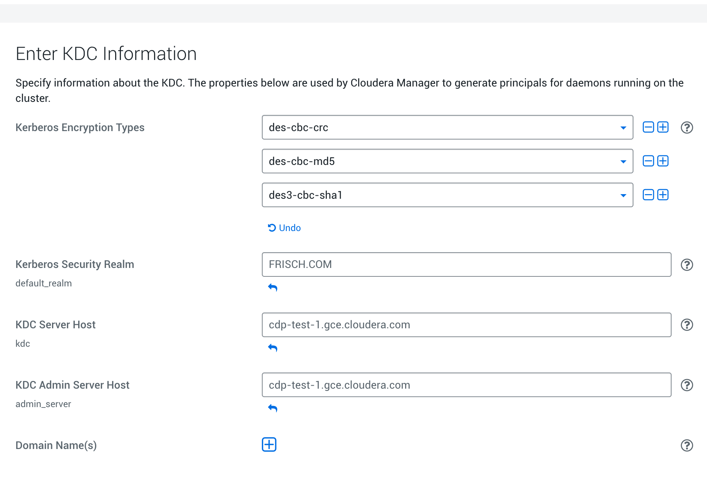

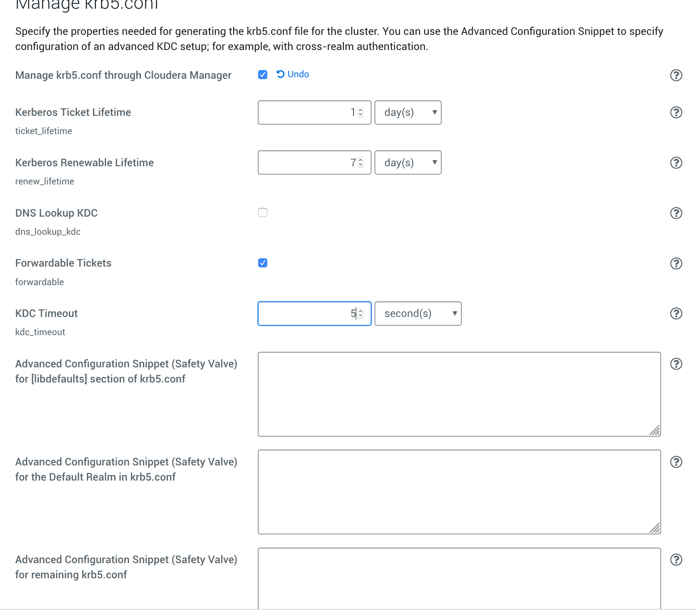

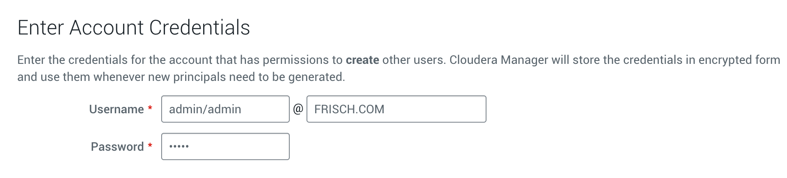

Finally, cluster must start properly with kerberos enabled:

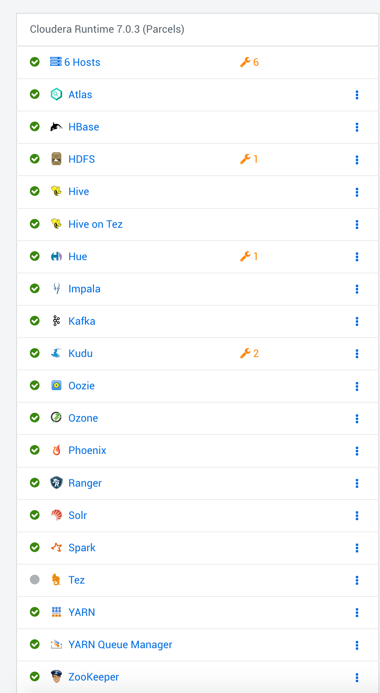

== Troubleshots

Hue Ticket Renewer were not working stating that tickets could not be renewed.

A "klist -fe /var/run/hue/hue_krb5_ccache" showed that they were indeed not renewable.

However a getprinc showed that they have a renawable life time of 7 days.

Solution was to re-setup a KDC for CM (same KDC) but specifying a renewable lifetime of 0 days, to force CM to use the one provided by kdc.conf.

== Setup local to acces UIs

Once Kerberos has been enabled, almost all UIs are kerberized, meaning SPNEGO is activated, and they could only be accessed by process having a valid keytab. 

=== Getting a valid keytab

__krb5.conf__ & __frisch.keytab__ have been downloaded from the cluster and have been put into directory __tools__.

Moreover __krb5.conf__ has been put to __/etc/__ directory.

Once Kerberos installed on the local machine, it is possible to do authenticate using:

      kinit -kt tools/frisch.keytab frisch@FRISCH.COM

=== Firefox setting

To enable Firefox to use kerberos ticket when connecting to the cluster, these properties have been added to firefox:

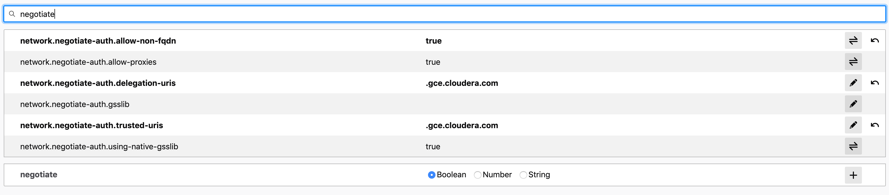

Note that Firefox was shutdown and then restarted after getting the kerberos ticket.

=== Check on UIs

List of UIs to check:
- ATLAS = Ok, no KRB
- HBase = Ok, no KRB
- Namenode UI = Ok (N.B: logs are inaccessible with 403: http://cdp-test-2.gce.cloudera.com:9870/logs/ => To check on more details )
- HS2 = Ok (N.B: logs are inaccessible with 404: http://cdp-test-3.gce.cloudera.com:10002/logs/ => Apparently they are missing)
- HUE = Ok but is not kerberized (and it could be)
- Impala = Ok, no KRB
- Kudu master & Tablet server = Ok, no KRB
- Oozie = Not Ok due to another error but ok after troubleshots (see Troubleshots section)
- Ranger = Ok, no KRB
- Spark = Ok, no KRB
- YARN RM & JobHistory = Ok

=== Hue SPNEGO activation

Go to HUE service > Configuration > Security, +
Change Authentication backend +
Restart Hue +
Login to Hue webserver using kerberos ticket (as it was already configured with web browser and obtained, nothing is needed) 
