= Ranger

== Ranger配置

Step1.  HDFS服务启用Ranger授权（进入HDFS设置页面，只需要勾选"Enable Ranger Authorization"，其他采取默认）：

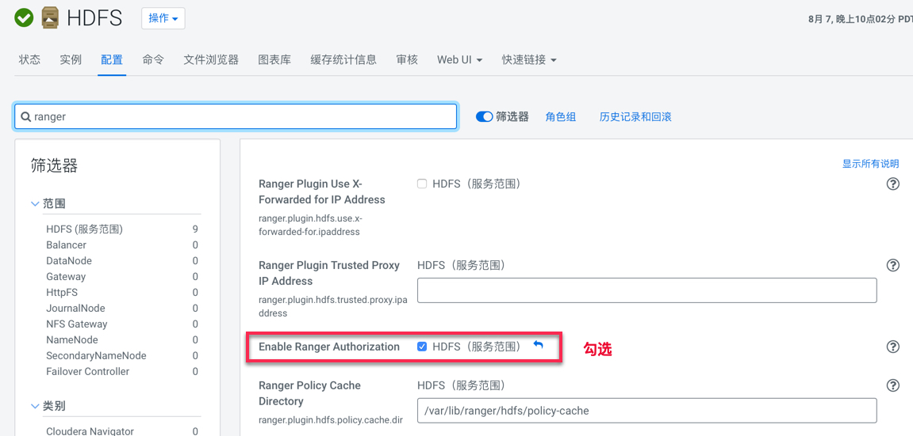

Step2.  Solr-infra服务启用Ranger授权（进入Solr-infra设置页面，只需要勾选"Enable Ranger Authorization for the Infrastructure Solr Service"，其他采取默认）：

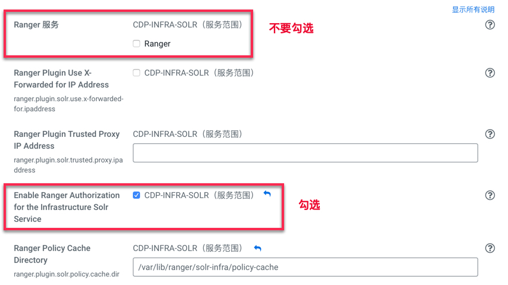

Step3.  Ranger服务初始化Plugin（进入Ranger主页面，点击"Setup Ranger Plugin Service"）

注意：该步操作需要10分钟左右。

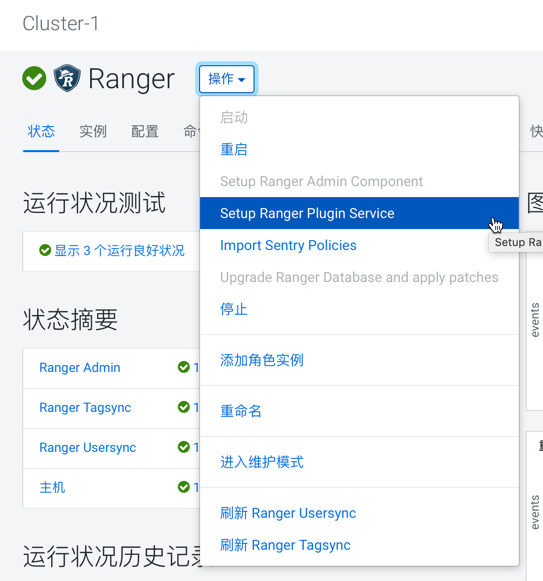

== HDFS

由于集群节点上不存在用户hdfs（在/etc/passwd中使用nologin选项），因此必须手动创建一个类hdfs用户。

Step1.  我们已经创建一个测试OS用户etl_user，并且配置了对应的HDFS主目录（/user/etl_user）和kerberos principle（etl_user/ccycloud-1.feng.root.hwx.site@FENG.COM），详见install_full_script.sh部分。

验证etl_user是否创建成功，可以在Ranger User List中进行搜索：

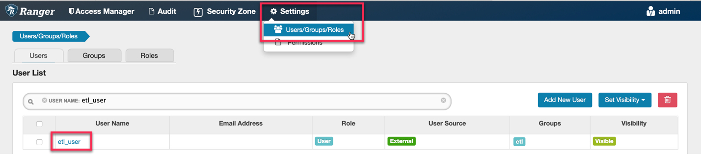

Step2.  在Ranger UI中，请对cm_hdfs进行了修改，启用Kerberos认证并使用HDFS HA：

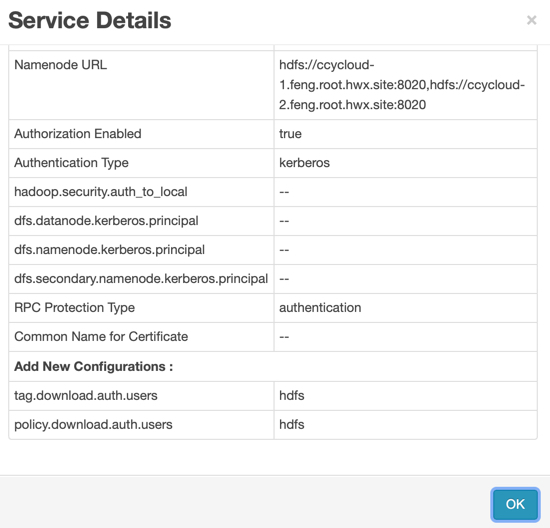

Step3.  修改cm_hdfs Policies ID 1:all - path，将etl_user添加进去，和hdfs用户具有相同的权限。

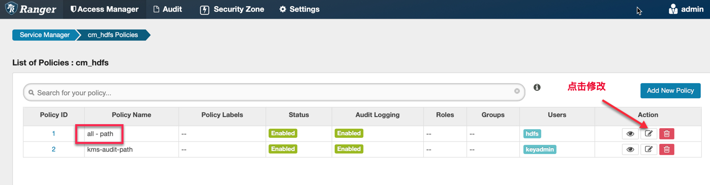

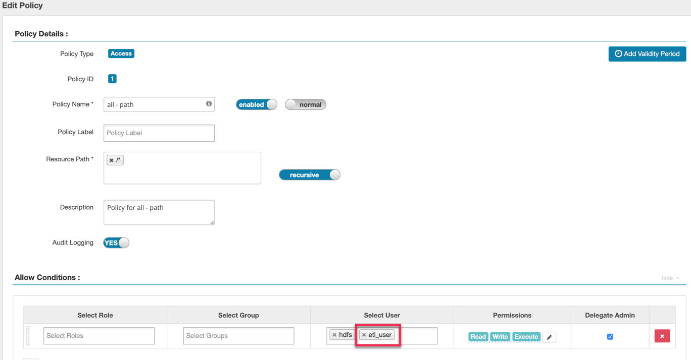

== YARN

Step1.  在Ranger UI中，请对cm_yarn进行了修改，启用Kerberos认证并使用YARN HA：

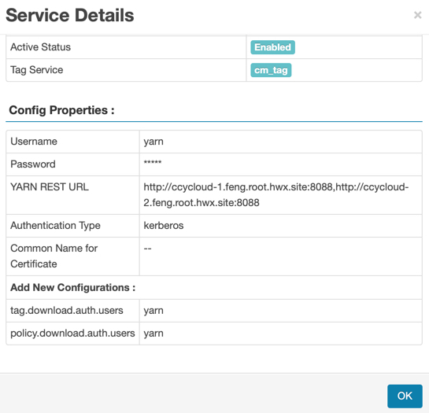

== HBase

Step1.  在Ranger UI中，请对cm_hbase进行了修改，启用Kerberos认证和指定HMaster principle：

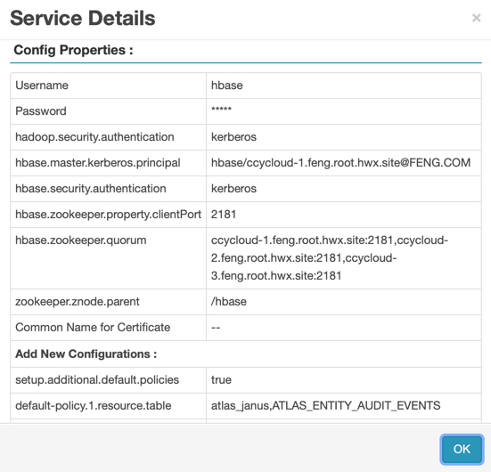

Step2.  对etl_user新建一个policy，赋予对test表的所有权限：

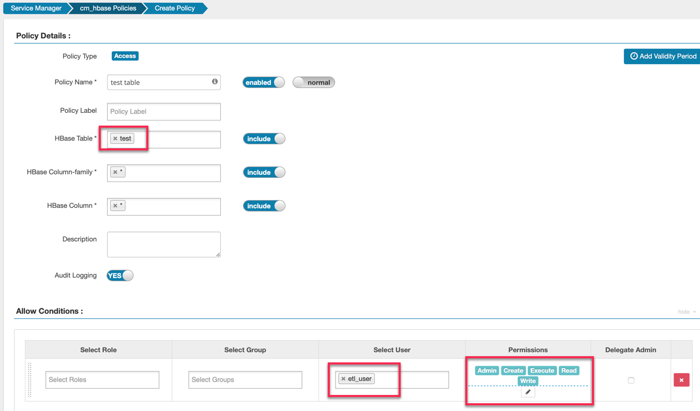

== Hive

如果用户创建了数据库或者表，那边他们应该拥有对这些对象的全部权限。现有的Hadoop SQL策略中已经包含了{OWNER}规则，所以不用另外赋权。

另外，可以给etl_user类似于hive用户的权限：

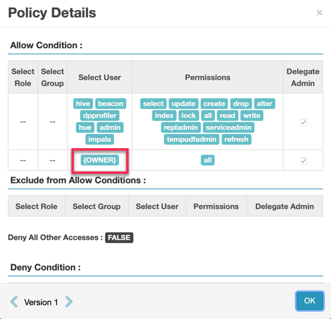
