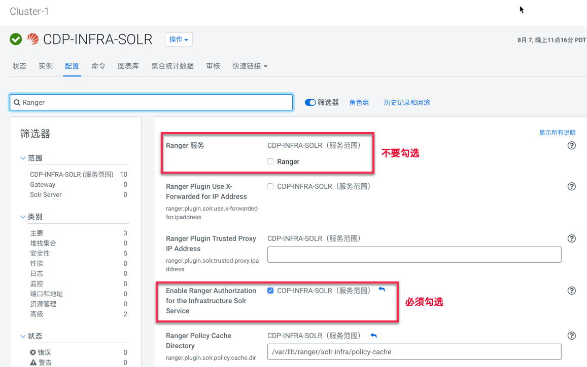

= Ranger

== Ranger配置

Step1.  HDFS服务启用Ranger授权（进入HDFS设置页面，只需要勾选"Enable Ranger Authorization"，其他采取默认）：

Step2.  Solr-infra服务启用Ranger授权（进入Solr-infra设置页面，只需要勾选"Enable Ranger Authorization for the Infrastructure Solr Service"，其他采取默认）：

Step3.  Ranger服务初始化Plugin（进入Ranger主页面，点击"Setup Ranger Plugin Service"）

== HDFS

由于集群节点上不存在用户hdfs（在/etc/passwd中使用nologin选项），因此必须手动创建一个类hdfs用户。

Step1.  我们已经创建一个测试OS用户etl_user，并且配置了对应的HDFS主目录（/user/etl_user）和kerberos principle（etl_user/ccycloud-1.feng.root.hwx.site@FENG.COM），详见install_full_script.sh部分。

验证etl_user是否创建成功，可以在Ranger User List中进行搜索：

image::pictures/Ranger001.jpg[Ranger etl_user]

Step2.  在Ranger UI中，请对cm_hdfs进行了修改，启用Kerberos认证并使用HDFS HA：

Step3.  修改cm_hdfs Policies ID 1:all - path，将etl_user添加进去，和hdfs用户具有相同的权限。

image::pictures/Ranger007.jpg[Policies ID 1]

== YARN

Ranger YARN plugin配置为YARN HA & Kerberos认证:

== HBase

User frisch has been granted privileges on only one table (the one required):

image::pictures/RangerHBasePolicy.png[frisch Ranger HBase Policy]

HBase has been properly configured in Ranger (Note that master principal was given with name of the machine in it):

image::pictures/RangerHBaseConfiguration.png[Hbase Ranger configuration]

It is now possible to launch load of data into tables with names like "randomy".

== Hive

With actual configuration, users should be able to create their own database and tables and have full rights on it (thanks to {OWNER} policies existing already).

== Kafka

Ranger Kafka plugin is configured correctly.

However, There is currently an IO error and it's impossible to set security settings as they are not recognized...

Client error:

[source,bash]
20/03/24 10:35:59 WARN network.Selector: Error in I/O with cdp-test-4.gce.cloudera.com/172.31.116.154
java.io.EOFException
	at org.apache.kafka.common.network.NetworkReceive.readFrom(NetworkReceive.java:62)
	at org.apache.kafka.common.network.Selector.poll(Selector.java:248)
	at org.apache.kafka.clients.NetworkClient.poll(NetworkClient.java:192)
	at org.apache.kafka.clients.producer.internals.Sender.run(Sender.java:191)
	at org.apache.kafka.clients.producer.internals.Sender.run(Sender.java:122)
	at java.lang.Thread.run(Thread.java:748)

Server error:

[source,bash]
INFO org.apache.kafka.common.network.Selector: [SocketServer brokerId=1546332425] Failed authentication with /172.31.116.157 (Unexpected Kafka request of type METADATA during SASL handshake.)

Note that another error (not related) is popping up from Kafka, about rangertagsync user not being created:

[source,bash]
2020-03-24 10:36:33,362 WARN org.apache.hadoop.security.ShellBasedUnixGroupsMapping: unable to return groups for user rangertagsync
PartialGroupNameException The user name 'rangertagsync' is not found. id: rangertagsync: no such user
id: rangertagsync: no such user

== Ozone

Ranger has been activated through CM UI, Ozone was hence restarted.

However, nothing in the ranger audits appeared and even after an Ozone restart, it does not seems that it is taken into account, as those logs from the OM shows:

[source,bash]
2020-03-24 09:40:03,094 INFO SecurityLogger.org.apache.hadoop.ipc.Server: Auth successful for frisch@FRISCH.COM (auth:KERBEROS)
2020-03-24 09:40:03,103 INFO SecurityLogger.org.apache.hadoop.security.authorize.ServiceAuthorizationManager: Authorization successful for frisch@FRISCH.COM (auth:KERBEROS) for protocol=interface org.apache.hadoop.ozone.om.protocol.OzoneManagerProtocol

Moreover Ranger Ozone configuration leads to following error:

        java.lang.NoClassDefFoundError: org/apache/hadoop/ozone/client/OzoneClientFactory.org/apache/hadoop/ozone/client/OzoneClientFactory.

== SolR

When trying to activate Ranger for SolR, following error occured in CM:

[source,bash]
Caused by: java.lang.IllegalArgumentException: Cyclic dependency: DbService{id=1546332223, name=ranger} -> DbService{id=1546332270, name=solr} -> DbService{id=1546332223, name=ranger}
	at com.cloudera.cmf.service.DependencyUtils.getAllDependenciesInternal(DependencyUtils.java:377)
	at com.cloudera.cmf.service.DependencyUtils.getAllDependenciesInternal(DependencyUtils.java:392)
	at com.cloudera.cmf.service.DependencyUtils.getAllDependenciesInternal(DependencyUtils.java:392)
	at com.cloudera.cmf.service.DependencyUtils.getAllDependenciesInternal(DependencyUtils.java:392)
	at com.cloudera.cmf.service.DependencyUtils.getAllDependenciesInternal(DependencyUtils.java:392)
	at com.cloudera.cmf.service.DependencyUtils.getAllDependencies(DependencyUtils.java:359)
	at com.cloudera.cmf.service.components.DependencyCache.getDependencies(DependencyCache.java:74)
	at com.cloudera.cmf.service.components.ConfigHelper.getDependencies(ConfigHelper.java:208)
	at com.cloudera.cmf.service.components.ConfigHelper.getDependencies(ConfigHelper.java:217)
	at com.cloudera.cmf.service.AbstractRoleHandler.generateClientConfigsForDependencies(AbstractRoleHandler.java:1143)
	at com.cloudera.cmf.service.AbstractRoleHandler.generateConfigFiles(AbstractRoleHandler.java:1086)
	... 26 more
2020-03-24 10:13:29,970 WARN Staleness-Detector-2:com.cloudera.cmf.service.config.components.ProcessStalenessDetector: Encountered exception while performing staleness check subtask

