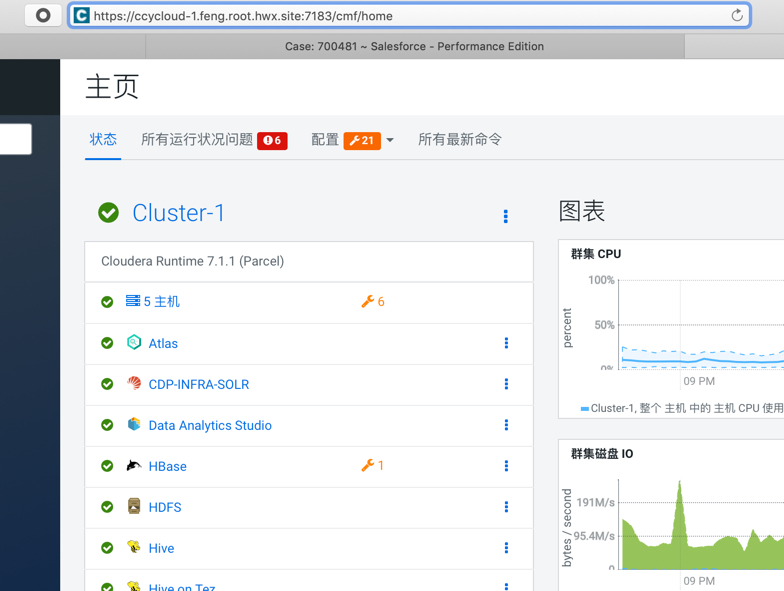

= 对CM&Agent配置TLS

**目录**

. <<生成Root certificate>> +
. <<生成Server certificates>> +
. <<jks文件验证>> +
. <<对CM&Agent设置TLS>>

https://docs.cloudera.com/cloudera-manager/7.1.1/security-encrypting-data-in-transit/topics/cm-security-how-to-configure-cm-tls.html[官网安装文档]

== 生成Root certificate 

以下操作详见link:install_full_script.sh[install_full_script.sh]部分。

**注意：**以下操作仅在CM节点上执行

Step1.  首先创建rootCA.key: +
**openssl genrsa -out rootCA.key 4096**
....
Generating RSA private key, 4096 bit long modulus
....

Step2.  然后由rootCA.key生成rootCA.crt: +
**openssl req -x509 -new -nodes -key rootCA.key -sha256 -days 1024 -out rootCA.crt**
....
You are about to be asked to enter information that will be incorporated
into your certificate request.
What you are about to enter is what is called a Distinguished Name or a DN.
There are quite a few fields but you can leave some blank
For some fields there will be a default value,
If you enter '.', the field will be left blank.
-----
Country Name (2 letter code) [XX]:CN
State or Province Name (full name) []:CHINA
Locality Name (eg, city) [Default City]:SHANGHAI
Organization Name (eg, company) [Default Company Ltd]:Cloudera
Organizational Unit Name (eg, section) []:SE
Common Name (eg, your name or your server's hostname) []:ccycloud-1.feng.root.hwx.site
Email Address []:xxxx@cloudera.com
....

Step3.  接下来生成truststore.jks： +
**keytool -importcert -alias rootca -keystore /opt/cloudera/security/pki/truststore.jks -file /opt/cloudera/security/pki/rootCA.crt**
....
Enter keystore password:
Re-enter new password:
Valid from: Sun Aug 09 17:40:28 PDT 2020 until: Tue May 30 17:40:28 PDT 2023
Certificate fingerprints:
	 MD5:  7C:53:35:00:D7:7C:F8:6E:33:28:3F:83:F0:2F:89:21
	 SHA1: 53:1A:34:0A:B0:AF:EE:B2:0D:05:7B:4D:AF:DE:AA:77:6E:E4:8C:CD
	 SHA256: AB:43:02:B7:6A:E0:45:63:6F:65:E5:2D:20:91:D8:C1:A7:69:C7:D6:12:9F:A2:3D:BD:1B:AF:02:6D:22:AF:BE
Signature algorithm name: SHA256withRSA
Subject Public Key Algorithm: 4096-bit RSA key
Version: 3

Extensions:

#1: ObjectId: 2.5.29.35 Criticality=false
AuthorityKeyIdentifier [
KeyIdentifier [
0000: FE D0 6B 94 F8 34 2D CF   4E 4F 80 E8 34 7D 0B D1  ..k..4-.NO..4...
0010: 07 E3 EF 6F                                        ...o
]
]

#2: ObjectId: 2.5.29.19 Criticality=false
BasicConstraints:[
  CA:true
  PathLen:2147483647
]

#3: ObjectId: 2.5.29.14 Criticality=false
SubjectKeyIdentifier [
KeyIdentifier [
0000: FE D0 6B 94 F8 34 2D CF   4E 4F 80 E8 34 7D 0B D1  ..k..4-.NO..4...
0010: 07 E3 EF 6F                                        ...o
]
]

Trust this certificate? [no]:  yes
Certificate was added to keystore
....

Step3.  将rootCA.crt & rootCA.key & truststore.jks同步到其他主机

....
scp /opt/cloudera/security/pki/rootCA.* root@ccycloud-2.feng.root.hwx.site:/opt/cloudera/security/pki/
scp /opt/cloudera/security/pki/truststore.jks root@ccycloud-2.feng.root.hwx.site:/opt/cloudera/security/pki/
scp /opt/cloudera/security/pki/rootCA.* root@ccycloud-3.feng.root.hwx.site:/opt/cloudera/security/pki/
scp /opt/cloudera/security/pki/truststore.jks root@ccycloud-3.feng.root.hwx.site:/opt/cloudera/security/pki/
scp /opt/cloudera/security/pki/rootCA.* root@ccycloud-4.feng.root.hwx.site:/opt/cloudera/security/pki/
scp /opt/cloudera/security/pki/truststore.jks root@ccycloud-4.feng.root.hwx.site:/opt/cloudera/security/pki/
scp /opt/cloudera/security/pki/rootCA.* root@ccycloud-5.feng.root.hwx.site:/opt/cloudera/security/pki/
scp /opt/cloudera/security/pki/truststore.jks root@ccycloud-5.feng.root.hwx.site:/opt/cloudera/security/pki/
....

Step4. 修改/etc/cloudera-scm-agent/config.ini，然后同步该文件到其他主机

....
vi /etc/cloudera-scm-agent/config.ini
  server_host=ccycloud-1.feng.root.hwx.site
  use_tls=1
  verify_cert_file=/opt/cloudera/security/pki/agent.crt
  client_key_file=/opt/cloudera/security/pki/agent.pem
  client_keypw_file=/etc/cloudera-scm-agent/agentkey.pw
  client_cert_file=/opt/cloudera/security/pki/agent.crt

scp /etc/cloudera-scm-agent/config.ini root@ccycloud-2.feng.root.hwx.site:/etc/cloudera-scm-agent/ 
scp /etc/cloudera-scm-agent/config.ini root@ccycloud-3.feng.root.hwx.site:/etc/cloudera-scm-agent/
scp /etc/cloudera-scm-agent/config.ini root@ccycloud-4.feng.root.hwx.site:/etc/cloudera-scm-agent/
scp /etc/cloudera-scm-agent/config.ini root@ccycloud-5.feng.root.hwx.site:/etc/cloudera-scm-agent/
....

Step4.  在CM节点上生成新的link文件，以允许CM server使用jks文件：
....
ln -s /opt/cloudera/security/pki/$(hostname -f).jks /opt/cloudera/security/pki/server.jks
....

== 生成Server certificates

以下操作详见link:install_full_script.sh[install_full_script.sh]部分。

**注意：**在每台主机上分别执行，生成的文件全部带有主机标识

Step1.  生成server jks文件 +
....
keytool -genkeypair -alias $(hostname -f) -keyalg RSA -keystore /opt/cloudera/security/pki/$(hostname -f).jks -keysize 2048 -dname "CN=$(hostname -f)" -ext san=dns:$(hostname -f),dns:${HOSTNAME}${1}  -storepass cloudera
....

Step2.  生成server csr文件 +
....
keytool -certreq -alias $(hostname -f) -keystore /opt/cloudera/security/pki/$(hostname -f).jks -file /opt/cloudera/security/pki/$(hostname -f).csr -ext san=dns:$(hostname -f)
....

Step3.  生成server crt文件 +
....
openssl x509 -req -CA rootCA.crt -CAkey rootCA.key -CAcreateserial -days 500 -sha256 -in /opt/cloudera/security/pki/$(hostname -f).csr -out /opt/cloudera/security/pki/$(hostname -f).crt
....

Step4.  将rootCA.crt添加入server crt文件 +
....
cat /opt/cloudera/security/pki/rootCA.crt >> /opt/cloudera/security/pki/$(hostname -f).crt
....

Step5.  导入server crt文件到jks文件中 +
....
keytool -importcert -alias $(hostname -f) -keystore /opt/cloudera/security/pki/$(hostname -f).jks -file /opt/cloudera/security/pki/$(hostname -f).crt  -storepass cloudera
....

Step6.  将Server jks转为p12文件 +
....
keytool -importkeystore -srckeystore /opt/cloudera/security/pki/$(hostname -f).jks -destkeystore /opt/cloudera/security/pki/$(hostname -f).p12 -srcalias $(hostname -f) -srcstoretype jks -deststoretype pkcs12  -storepass cloudera
....

Step7.  将Server p12转为pem文件 +
....
openssl pkcs12 -in /opt/cloudera/security/pki/$(hostname -f).p12 -out /opt/cloudera/security/pki/$(hostname -f).pem -password pass:cloudera -passin pass:cloudera -passout pass:cloudera
....

Step8.  必须在所有节点上建立新的link文件，以允许CM Agent使用agent.pem、agent.crt、agentkey.pw三个文件：
....
ln -s /opt/cloudera/security/pki/$(hostname -f).pem /opt/cloudera/security/pki/agent.pem
ln -s /opt/cloudera/security/pki/$(hostname -f).crt /opt/cloudera/security/pki/agent.crt
echo "cloudera" > /etc/cloudera-scm-agent/agentkey.pw
chown root:root /etc/cloudera-scm-agent/agentkey.pw
chmod 440 /etc/cloudera-scm-agent/agentkey.pw
chmod 444 /opt/cloudera/security/pki/*
chmod 400 /opt/cloudera/security/pki/rootCA.*
....

== jks文件验证

在每台主机上，__/opt/cloudera/security/pki/__下有三个重要文件：agent.crt，agent.pem，truststore.jks，在后续配置中都会用到。 +
在CM主机上，还多了一个重要文件：server.jks，在后续配置中也会用到。

* 使用CA certificates signer:
....
lrwxrwxrwx 1 root root   58 Mar 26 03:53 agent.pem -> /opt/cloudera/security/pki/cdp-test-1.gce.cloudera.com.pem
-rw-r--r-- 1 root root 1055 Mar 26 02:03 cdp-test-1.gce.cloudera.com.csr
-rw-r--r-- 1 root root 8107 Mar 26 07:34 cdp-test-1.gce.cloudera.com.jks
-rw-r--r-- 1 root root 4618 Mar 26 07:33 cdp-test-1.gce.cloudera.com.pem
lrwxrwxrwx 1 root root   58 Mar 26 07:43 keystore.jks -> /opt/cloudera/security/pki/cdp-test-1.gce.cloudera.com.jks
-rw-r--r-- 1 root root 2045 Mar 26 03:05 rootca.pem
lrwxrwxrwx 1 root root   58 Mar 26 07:14 server.jks -> /opt/cloudera/security/pki/cdp-test-1.gce.cloudera.com.jks
-rw-r--r-- 1 root root 1532 Mar 26 07:52 truststore.jks
....

* 使用self-signed certificates:
....
lrwxrwxrwx 1 root root   60 Aug 10 02:36 agent.crt -> /opt/cloudera/security/pki/ccycloud-1.feng.root.hwx.site.crt
lrwxrwxrwx 1 root root   60 Aug  9 19:35 agent.pem -> /opt/cloudera/security/pki/ccycloud-1.feng.root.hwx.site.pem
-r--r--r-- 1 root root 3700 Aug  9 18:17 ccycloud-1.feng.root.hwx.site.crt
-r--r--r-- 1 root root 1105 Aug  9 18:13 ccycloud-1.feng.root.hwx.site.csr
-r--r--r-- 1 root root 4036 Aug  9 18:18 ccycloud-1.feng.root.hwx.site.jks
-r--r--r-- 1 root root 4789 Aug  9 18:20 ccycloud-1.feng.root.hwx.site.p12
-r--r--r-- 1 root root 6403 Aug  9 18:24 ccycloud-1.feng.root.hwx.site.pem
-r-------- 1 root root 2163 Aug  9 18:11 rootCA.crt
-r-------- 1 root root 3243 Aug  9 18:09 rootCA.key
-r-------- 1 root root   17 Aug  9 18:14 rootCA.srl
lrwxrwxrwx 1 root root   60 Aug 10 02:38 server.jks -> /opt/cloudera/security/pki/ccycloud-1.feng.root.hwx.site.jks
-r--r--r-- 1 root root 1618 Aug  9 18:12 truststore.jks
....

* 检测1. 如果您查看keystore.jks，您会发现一个privateKeyEntry（实际上，它由相应的已签名证书和root ca来enrich，以具有整个认证链）： +
**keytool -list -keystore /opt/cloudera/security/pki/keystore.jks**
....
Enter keystore password:
Keystore type: jks
Keystore provider: SUN

Your keystore contains 1 entry

ccycloud-1.feng.root.hwx.site, Aug 9, 2020, PrivateKeyEntry,
Certificate fingerprint (SHA1): 61:77:7D:B9:73:BD:A0:BD:61:8D:9A:37:A3:07:42:2F:78:28:63:F9

Warning:
The JKS keystore uses a proprietary format. It is recommended to migrate to PKCS12 which is an industry standard format using "keytool -importkeystore -srckeystore /opt/cloudera/security/pki/keystore.jks -destkeystore /opt/cloudera/security/pki/keystore.jks -deststoretype pkcs12".
....

* 检测2. 如果您查看truststore.jks，您会发现里面有一个rootca +
**keytool -list -keystore /opt/cloudera/security/pki/truststore.jks**
....
Enter keystore password:
Keystore type: jks
Keystore provider: SUN

Your keystore contains 1 entry

rootca, Aug 9, 2020, trustedCertEntry,
Certificate fingerprint (SHA1): 0A:14:B1:2D:31:97:C3:A4:4D:AE:E8:E8:13:3F:B8:6C:5F:38:84:16
....

== 对CM&Agent设置TLS

Step1.  进入CM页面，管理->设置->搜索栏输入"TLS"，有四项必须勾上，有四项必须填写：
....
Cloudera Manager TLS/SSL 服务器 JKS Keystore 文件位置：/opt/cloudera/security/pki/server.jks
Cloudera Manager TLS/SSL 服务器 JKS Keystore 文件密码：cloudera
Cloudera Manager TLS/SSL 证书信任存储库文件/opt/cloudera/security/pki/truststore.jks
Cloudera Manager TLS/SSL 证书信任存储库密码：cloudera
....

image::pictures/CMTLS001.jpg[CM TLS configuration]

Step2.  重启CM Server和CM Agent服务
....
systemctl restart cloudera-scm-server
systemctl restart cloudera-scm-agent
....

Step3.  CM页面开始使用https协议和7183端口。

Step4.  进入Cloudera Management Service服务页面，进入"配置"标签页面，搜索"TLS"，有两项必须填写：
....
TLS/SSL 客户端 Truststore 文件位置：/opt/cloudera/security/pki/truststore.jks
Cloudera Manager Server TLS/SSL 证书信任存储库密码：cloudera
....

image::pictures/CMTLS002.jpg[CM Management TLS configuration]

Step5.  重启Cloudera Management Service服务

Step6.  集群恢复正常状态

