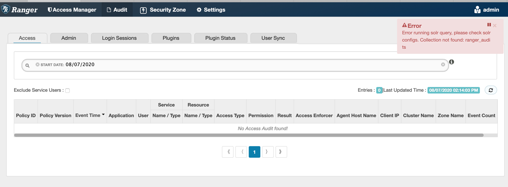
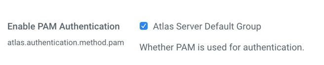

= Troubleshoots

**目录**

. Ranger +
.. <<Collection not found: ranger_audits>> +
.. <<Error occured while writing audit log>> +
. Atlas +
.. <<PAM Authentication Failed>>

== Ranger

=== Collection not found: ranger_audits

**症状：** Ranger Audit UI报错：

CDP-INFRA-SOLR的Solr Server日志报错： +
....
ERROR collections.OverseerCollectionMessageHandler: [OverseerThreadFactory-9-thread-5-processing-n:ccycloud-5.feng.root.hwx.site:8993_solr]: Error from shard: http://ccycloud-3.feng.root.hwx.site:8993/solr
org.apache.solr.client.solrj.impl.HttpSolrClient$RemoteSolrException: Error from server at http://ccycloud-3.feng.root.hwx.site:8993/solr: Error CREATEing SolrCore 'ranger_audits_shard1_replica_n1': Unable to create core [ranger_audits_shard1_replica_n1] Caused by: The configset for this collection was uploaded without any authentication in place, and use of <lib> is not available for collections with untrusted configsets. To use this component, re-upload the configset after enabling authentication and authorization.
....

**根源：** 在添加Ranger和Atlas服务之前，集群必须启用kerberos。Ranger的configset中<lib>相关item无法在非安全的集群中使用。

**解决方案：**  +
1）集群启用Kerberos +
2）停止Slor和Ranger服务 +
3）执行命令：solrctl --zk ccycloud-1.feng.root.hwx.site:2181,ccycloud-2.feng.root.hwx.site:2181,ccycloud-3.feng.root.hwx.site:2181/solr-infra instancedir --delete ranger_audits +
4）启动Slor和Ranger服务

=== Error occured while writing audit log

**症状：** Solr-Infra日志报错:
....
20/08/10 23:55:21 ERROR audit.RangerMultiResourceAuditHandler: [qtp375457936-15]: Error occured while writing audit log... 
java.lang.NullPointerException: null
	at org.apache.ranger.plugin.audit.RangerMultiResourceAuditHandler.flushAudit(RangerMultiResourceAuditHandler.java:53) ~[ranger-plugins-common-2.0.0.7.1.3.0-100.jar:2.0.0.7.1.3.0-100]
	at org.apache.ranger.authorization.solr.authorizer.RangerSolrAuthorizer.authorize(RangerSolrAuthorizer.java:344) ~[ranger-solr-plugin-shim-2.0.0.7.1.3.0-100.jar:2.0.0.7.1.3.0-100]
	at org.apache.ranger.authorization.solr.authorizer.RangerSolrAuthorizer.authorize(RangerSolrAuthorizer.java:152) ~[ranger-solr-plugin-shim-2.0.0.7.1.3.0-100.jar:2.0.0.7.1.3.0-100]
	at org.apache.solr.servlet.HttpSolrCall.authorize(HttpSolrCall.java:473) ~[solr-core-8.4.1.7.1.3.0-100.jar:8.4.1.7.1.3.0-100 eb76c74ad38c49ddf6a812aed57c8249cddffed0 - jenkins - 2020-08-05 11:01:22]
	at org.apache.solr.servlet.HttpSolrCall.call(HttpSolrCall.java:552) ~[solr-core-8.4.1.7.1.3.0-100.jar:8.4.1.7.1.3.0-100 eb76c74ad38c49ddf6a812aed57c8249cddffed0 - jenkins - 2020-
...
	at org.eclipse.jetty.util.thread.QueuedThreadPool.runJob(QueuedThreadPool.java:806) [jetty-util-9.4.26.v20200117.jar:9.4.26.v20200117]
	at org.eclipse.jetty.util.thread.QueuedThreadPool$Runner.run(QueuedThreadPool.java:938) [jetty-util-9.4.26.v20200117.jar:9.4.26.v20200117]
	at java.lang.Thread.run(Thread.java:748) [?:1.8.0_232]
....

**根源：** /opt/cloudera/parcels/CDH/lib/solr/clusterconfig/hadoop_multi_scheme_config.json文件需要做些调整： +
1）将 "class": "org.apache.solr.security.HadoopAuthPlugin" 改成  "class":"org.apache.solr.security.ConfigurableInternodeAuthHadoopPlugin" +
2）添加一行 "clientBuilderFactory": "org.apache.solr.client.solrj.impl.Krb5HttpClientBuilder" 

**解决方案：**  +
将link:tools[tools]目录下的hadoop_multi_scheme_config.json文件分发到集群所有主机。

== Atlas

=== PAM Authentication Failed

**症状：** Atlas日志报错：
....
[etp1073763441-106:] ~ Error while PAM authentication (AtlasAuthenticationProvider:119)
org.apache.atlas.web.security.AtlasAuthenticationException: PAM Authentication Failed
        at org.apache.atlas.web.security.AtlasPamAuthenticationProvider.authenticate(AtlasPamAuthenticationProvider.java:69)
        at org.apache.atlas.web.security.AtlasAuthenticationProvider.authenticate(AtlasAuthenticationProvider.java:117)
        at org.springframework.security.authentication.ProviderManager.authenticate(ProviderManager.java:174)
        at org.springframework.security.authentication.ProviderManager.authenticate(ProviderManager.java:199)
        at org.springframework.security.web.authentication.UsernamePasswordAuthenticationFilter.attemptAuthentication(UsernamePasswordAuthenticationFilter.java:94)
        at org.springframework.security.web.authentication.AbstractAuthenticationProcessingFilter.doFilter(AbstractAuthenticationProcessingFilter.java:212)
        at org.springframework.security.web.FilterChainProxy$VirtualFilterChain.doFilter(FilterChainProxy.java:331)
        at org.springframework.security.web.authentication.logout.LogoutFilter.doFilter(LogoutFilter.java:116)
        at org.springframework.security.web.FilterChainProxy$VirtualFilterChain.doFilter(FilterChainProxy.java:331)
....
**根源：** CDP7.1默认开了PAM，导致file based auth user 失效。

**解决方案：** 将下面的勾去掉，然后重启Atlas服务。

