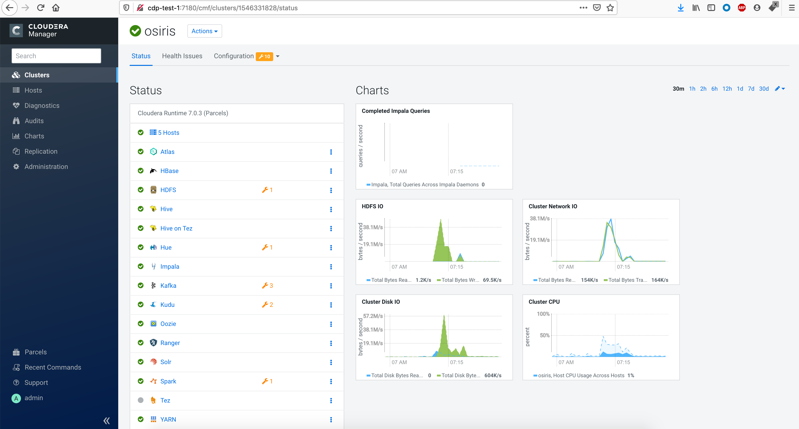
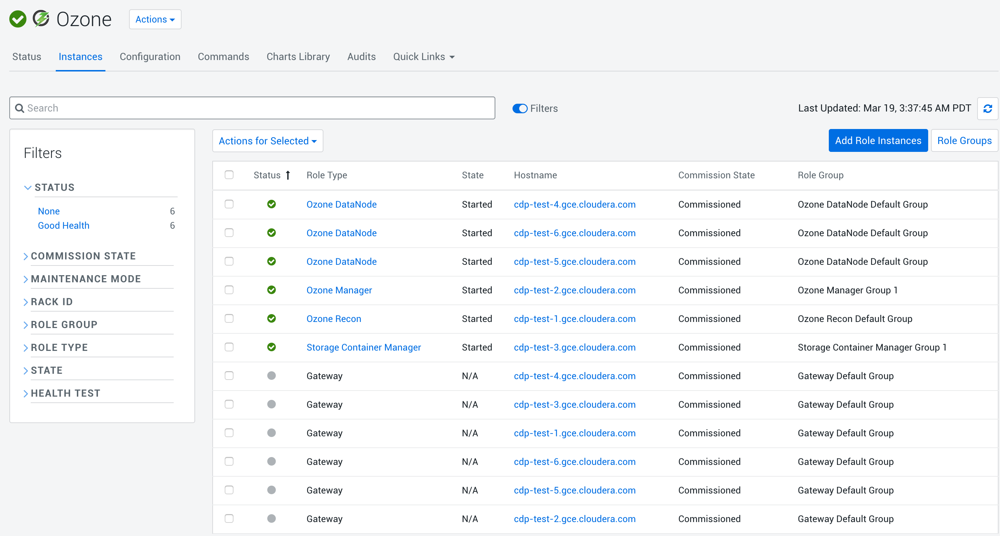

= 安装CDP

== 上传License

CDP"Try Cloudera Data Platform for 60 days"

image::pictures/CDP001.png

== Cloudera Manager

Step1:

image::pictures/CDP002.png

Step2:

image::pictures/CDP003.png

Cloudera Manager Agent

image::pictures/CDP014.png

Step3:

image::pictures/CDP004.png

Parcel Repository & Network Settingscdp7.1.1URL
image::pictures/CDP005.png

Step4:OpenJDK8"Manually manage JDK"

image::pictures/CDP006.png

Step5:

image::pictures/CDP007.png

Step6:Cloudera Manager Agent

image::pictures/CDP008.png

Step7:CDH parcel

image::pictures/CDP009.png

Step8:

image::pictures/CDP010.png


image::pictures/CDP011.png


image::pictures/CDP012.png

== 

Step1Data Engineering

image::pictures/CDP013.png

Step2

https://docs.cloudera.com/cloudera-manager/7.1.1/installation/topics/cdpdc-runtime-cluster-hosts-role-assignments.html
Architecture is the following:

image::pictures/CDP015.png

Node 1: Cloudera Manager Server + PostgresSQL database
Node 2 & 3: Masters & Utility/Gateway hosts containing master services and all servers needed
Node 4, 5, 6: Datanodes containing also Zookeeper & Kafka brokers

Test Connection and go through wizard.

These settings have been set:
- Yarn queue manager ui user/password= admin/admin
- Ranger passwords: Admin1234
- Kudu WALs directory = /tmp/kudu
- Kudu data directory = /data/kudu
- Ozone ID was set to ozone-fri

== Troubleshots

- Kudu setting was wrong and set to /tmp, hence it changed all /tmp directories to belong Kudu user, that was changed by setting back root:root and giving 777 permissions on /tmp
- Namenode failed to start because it was unable to format, as there were already data in namenode directories. Data has been manually erased using : rm -rf /dfs/nn

Final view:

== Adding services later

=== Ozone

Ozone was added by setting Gateway on all nodes, SCM an OM on nodes 2 & 3, Recon on node 1 and Datanodes on actual Datanodes.

Ozone Recon was not starting, due to error: 

[source,bash]
log4j:ERROR Could not instantiate class [org.cloudera.log4j.redactor.RedactorAppender].
java.lang.ClassNotFoundException: org.cloudera.log4j.redactor.RedactorAppender

This is described here: link:https://issues.apache.org/jira/browse/HDDS-2857[https://issues.apache.org/jira/browse/HDDS-2857]

WARNING: It is not precised but Ozone does not support HA on OM & SCM, so set only one instance of each ! 
=> After removing one SCM & one OM, Recon, OM & SCM started well, however Datanode not...

[source,bash]
2020-03-19 03:24:25,465 ERROR org.apache.hadoop.ozone.container.common.states.endpoint.VersionEndpointTask: Error during formatting volume /hadoop-ozone/datanode/data/hdds, exception is {}
org.apache.hadoop.ozone.common.InconsistentStorageStateException: Mismatched ClusterIDs. Version File : /hadoop-ozone/datanode/data/hdds/VERSION has clusterID: CID-55617385-a051-407f-95f9-d065ddb290ae and Datanode has clusterID: CID-e6d736f5-f8fc-43de-b6d5-c891424570d3
	at org.apache.hadoop.ozone.container.common.utils.HddsVolumeUtil.getClusterID(HddsVolumeUtil.java:93)
	at org.apache.hadoop.ozone.container.common.volume.HddsVolume.readVersionFile(HddsVolume.java:321)

=> removing file /hadoop-ozone/datanode/data/hdds/VERSION on node 4,5,6 to force DN to recreate it

Then, this error occurred on all DNs
[source,bash]
2020-03-19 03:30:11,638 INFO org.apache.hadoop.ozone.container.common.volume.HddsVolume: Creating Volume: /hadoop-ozone/datanode/data/hdds of  storage type : DISK and capacity : 107361267712
2020-03-19 03:30:11,640 ERROR org.apache.hadoop.ozone.container.common.volume.VolumeSet: Failed to parse the storage location: /hadoop-ozone/datanode/data
java.io.IOException: Volume is in an INCONSISTENT state. Skipped loading volume: /hadoop-ozone/datanode/data/hdds
	at org.apache.hadoop.ozone.container.common.volume.HddsVolume.initialize(HddsVolume.java:225)
	at org.apache.hadoop.ozone.container.common.volume.HddsVolume.<init>(HddsVolume.java:179)

=> Stop & Delete DNs, remove all folder /hadoop-ozone/datanode/data 
=> Then add DN one by one

Finally is setup and working:

