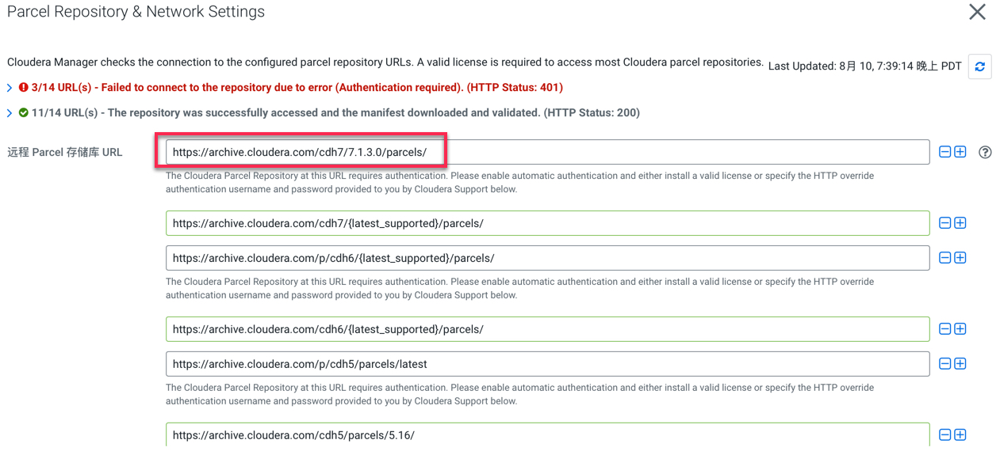
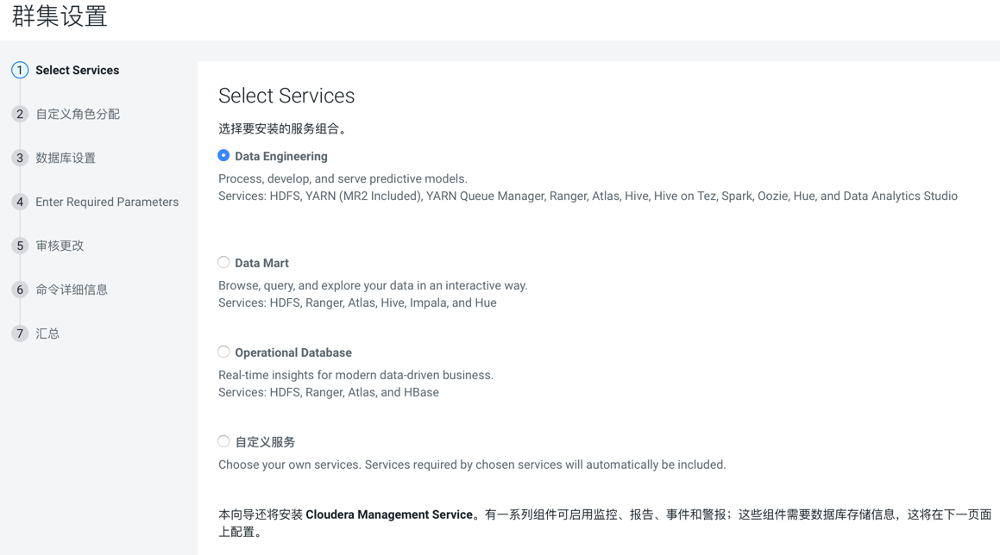
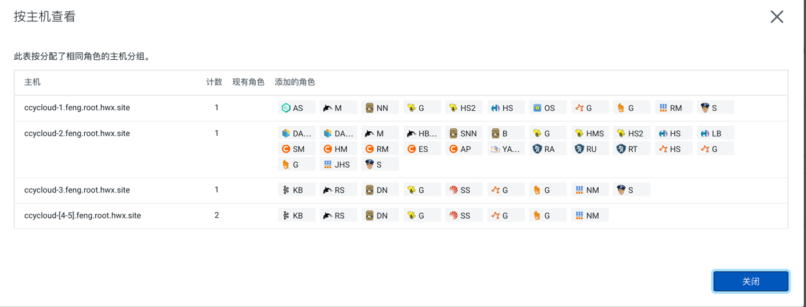

= 安装CDP

== 上传License

如果没有CDP license，可以选择"Try Cloudera Data Platform for 60 days"

image::pictures/CDP001.jpg[license]

== 安装Cloudera Manager Agent和CDH Parcle

=== Step1:给新集群命名

image::pictures/CDP002.jpg[cluster name]

=== Step2:选择目标主机

image::pictures/CDP003.jpg[select hosts]

由于第一台主机已经安装过Cloudera Manager Agent，所以会显示为灰色，但也要勾选上

image::pictures/CDP014.jpg[select hosts]

=== Step3:选择软件包下载地址

注意：Parcel Repository & Network Settings需要填写cdp7.1.1对应的URL

=== Step4:由于OpenJDK8已经提前安装好了，所以选择"Manually manage JDK"

image::pictures/CDP006.jpg[select JDK]

=== Step5:填写用户名和密码

=== Step6:安装Cloudera Manager Agent

image::pictures/CDP008.jpg[install Agent]

=== Step7:安装CDH parcel

=== Step8:集群检查（网络性能和主机扫描）

image::pictures/CDP010.jpg[inspector]

网络性能检查：

主机整体扫描：

image::pictures/CDP012.jpg[inspector]

== 添加服务组件

=== Step1：以Data Engineering为例

=== Step2：角色分配可以参考以下链接：
https://docs.cloudera.com/cloudera-manager/7.1.1/installation/topics/cdpdc-runtime-cluster-hosts-role-assignments.html

各主机角色分配示例如下：

=== Step3：测试数据库连接

image::pictures/CDP017.jpg[database connection]

=== Step4：输入必要的参数，主要是ranger服务的四个密码设置

[source,bash]
ranger-keyadmin_user_password = Admin1234
ranger-rangeradmin_user_password = Admin1234
ranger-rangertagsync_user_password = Admin1234
ranger-rangerusersync_user_password = Admin1234

image::pictures/CDP018.jpg[setting1]

=== Step5：审核更改，主要是调整Atlas的两个参数

image::pictures/CDP019.jpg[setting2]

=== Step6：在参数设置完毕后，集群首次启动

image::pictures/CDP020.jpg[first run]

=== Step7：启动成功

== Troubleshoots

- Kudu setting was wrong and set to /tmp, hence it changed all /tmp directories to belong Kudu user, that was changed by setting back root:root and giving 777 permissions on /tmp
- Namenode failed to start because it was unable to format, as there were already data in namenode directories. Data has been manually erased using : rm -rf /dfs/nn

Final view:

image::pictures/osirisCluster.jpg[Final view of the cluster]

== Adding services later

== Ozone

Ozone was added by setting Gateway on all nodes, SCM an OM on nodes 2 & 3, Recon on node 1 and Datanodes on actual Datanodes.

Ozone Recon was not starting, due to error: 

[source,bash]
log4j:ERROR Could not instantiate class [org.cloudera.log4j.redactor.RedactorAppender].
java.lang.ClassNotFoundException: org.cloudera.log4j.redactor.RedactorAppender

This is described here: link:https://issues.apache.org/jira/browse/HDDS-2857[https://issues.apache.org/jira/browse/HDDS-2857]

WARNING: It is not precised but Ozone does not support HA on OM & SCM, so set only one instance of each ! 
=> After removing one SCM & one OM, Recon, OM & SCM started well, however Datanode not...

[source,bash]
2020-03-19 03:24:25,465 ERROR org.apache.hadoop.ozone.container.common.states.endpoint.VersionEndpointTask: Error during formatting volume /hadoop-ozone/datanode/data/hdds, exception is {}
org.apache.hadoop.ozone.common.InconsistentStorageStateException: Mismatched ClusterIDs. Version File : /hadoop-ozone/datanode/data/hdds/VERSION has clusterID: CID-55617385-a051-407f-95f9-d065ddb290ae and Datanode has clusterID: CID-e6d736f5-f8fc-43de-b6d5-c891424570d3
	at org.apache.hadoop.ozone.container.common.utils.HddsVolumeUtil.getClusterID(HddsVolumeUtil.java:93)
	at org.apache.hadoop.ozone.container.common.volume.HddsVolume.readVersionFile(HddsVolume.java:321)

=> removing file /hadoop-ozone/datanode/data/hdds/VERSION on node 4,5,6 to force DN to recreate it

Then, this error occurred on all DNs
[source,bash]
2020-03-19 03:30:11,638 INFO org.apache.hadoop.ozone.container.common.volume.HddsVolume: Creating Volume: /hadoop-ozone/datanode/data/hdds of  storage type : DISK and capacity : 107361267712
2020-03-19 03:30:11,640 ERROR org.apache.hadoop.ozone.container.common.volume.VolumeSet: Failed to parse the storage location: /hadoop-ozone/datanode/data
java.io.IOException: Volume is in an INCONSISTENT state. Skipped loading volume: /hadoop-ozone/datanode/data/hdds
	at org.apache.hadoop.ozone.container.common.volume.HddsVolume.initialize(HddsVolume.java:225)
	at org.apache.hadoop.ozone.container.common.volume.HddsVolume.<init>(HddsVolume.java:179)

=> Stop & Delete DNs, remove all folder /hadoop-ozone/datanode/data 
=> Then add DN one by one

Finally is setup and working:

image::pictures/ozoneGreen.jpg[Ozone set up and working]