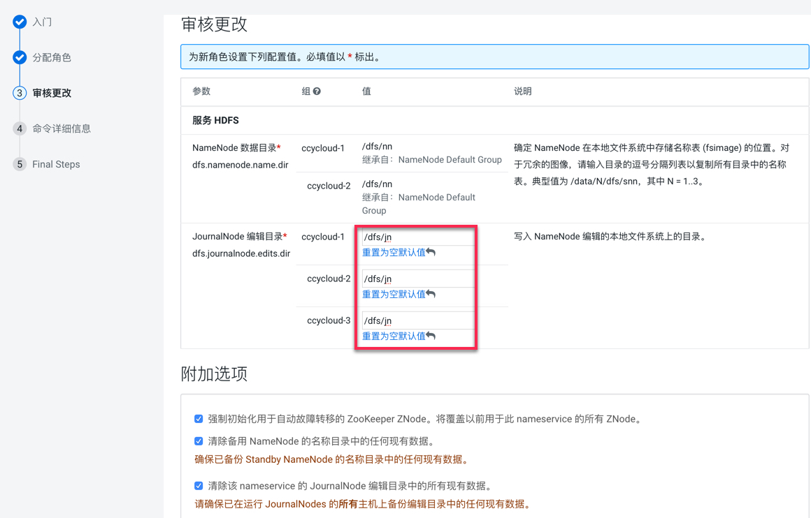
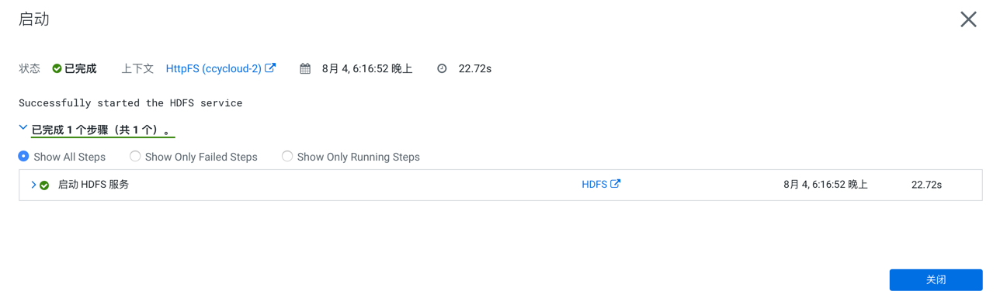
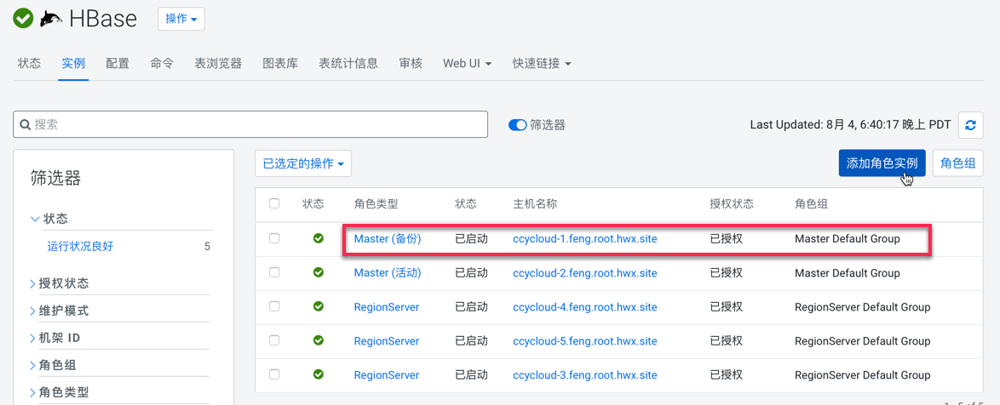
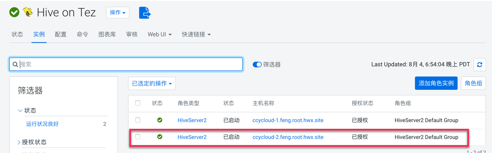

= HA设置

== HDFS

=== 配置HDFS HA

Step1.  进入HDFS服务页面，点击"启用High Availability"

image::pictures/HA001.jpg[Enable High Availability]

Step2.  指定一个Nameservice名称，默认为nameservice1

image::pictures/HA002.jpg[nameservice1]

Step3.	指定NameNode Standby Host和JournalNode Hosts

image::pictures/HA003.jpg[JournalNode Hosts]

Step4.	填写JournalNode Edits Directory，此处设置为/dfs/jn

Step5.	Cloudera Manager执行一系列的命令进行HA配置

image::pictures/HA005.jpg[First Run]

Step6.  执行结束，提示Hue和Hive Metastore需要配合HDFS进行配置修改

image::pictures/HA006.jpg[Final Step]

=== 配置Hive Metastore使用HDFS HA

Step1.  停止Hive服务，然后备份Hive Metastore的数据，即将元数据从MySQL库中导出到一个安全目录。由于本次是初始安装，因此未做备份操作

image::pictures/HA007.jpg[Stop Hive Service]

image::pictures/HA008.jpg[Stop Hive Service]

Step2.  点击更新Hive Metastore NameNodes

image::pictures/HA009.jpg[Update Hive Metastore NameNodes]

image::pictures/HA010.jpg[Update Hive Metastore NameNodes]

Step3.	Cloudera Manager执行一系列的命令进行更新配置，直至执行结束

image::pictures/HA011.jpg[First Run]

=== 配置Hue使用HDFS HA

Step1.  进入HDFS服务页面，进入"实例"标签页面，点击"添加角色实例"

image::pictures/HA012.jpg[Add Role Instances]

Step2.  点击HttpFS角色下面文本框选择主机

image::pictures/HA013.jpg[Add HttpFS]

image::pictures/HA014.jpg[Add HttpFS]

Step3.  启动HttpFS角色

image::pictures/HA015.jpg[Start HttpFS]

Step4.  进入Hue服务页面，进入"配置"标签页面，搜索"HDFS Web"，选中httpfs单选框

image::pictures/HA017.jpg[Select HttpFS]

Step5.  点击保存修改并重启Hue服务

https://docs.cloudera.com/runtime/7.1.1/fault-tolerance/topics/cr-high-availablity-on-cdp-clusters.html[参考链接]

== YARN 

Step1.  进入YARN服务页面，点击"启用High Availability"

image::pictures/HA018.jpg[Enable High Avaibility]

Step2.  指定Resource Manager Standby Host

image::pictures/HA019.jpg[Resource Manager Standby Host]

Step3.	Cloudera Manager执行一系列的命令进行HA配置，直至执行结束，不需要后续操作

image::pictures/HA020.jpg[First Run]

https://docs.cloudera.com/runtime/7.1.1/yarn-high-availability/topics/yarn-resourcemanager-ha-overview.html[参考链接]

== HBase

进入HBase服务页面，进入"实例"标签页面，点击"添加角色实例"，在另一台主机上部署Standby HMaster实例

https://docs.cloudera.com/runtime/7.1.1/hbase-high-availability/topics/hbase-enable-ha-using-cm.html[参考链接]

== Hue

进入Hue服务页面，进入"实例"标签页面，点击"添加角色实例"，在另一台主机上部署Hue Server实例

image::pictures/HA022.jpg[Enable High Avaibility]

https://docs.cloudera.com/runtime/7.1.1/administering-hue/topics/hue-add-role-instance-with-cm.html[参考链接]

== Hive

进入Hive on Tez服务页面，进入"实例"标签页面，点击"添加角色实例"，在另一台主机上部署Hive Server2实例

https://docs.cloudera.com/runtime/7.1.1/hive-metastore/topics/hive-hms-introduction.html[参考链接]

== Oozie

Installation of a Load Balancer (haproxy): +
[source,bash]
yum install haproxy
cp /etc/haproxy/haproxy.cfg haproxy.cfg

Configure haproxy by editing oozie.cfg: +
[source,bash]
----
global
    log         127.0.0.1 local2

    chroot      /var/lib/haproxy
    pidfile     /var/run/haproxy.pid
    maxconn     4000
    user        haproxy
    group       haproxy
    daemon

    # turn on stats unix socket
    stats socket /var/lib/haproxy/stats

#---------------------------------------------------------------------
# common defaults that all the 'listen' and 'backend' sections will
# use if not designated in their block
#---------------------------------------------------------------------
defaults
    mode                    http
    log                     global
    option                  httplog
    option                  dontlognull
    option http-server-close
    option forwardfor       except 127.0.0.0/8
    option                  redispatch
    retries                 3
    timeout http-request    10s
    timeout queue           1m
    timeout connect         10s
    timeout client          1m
    timeout server          1m
    timeout http-keep-alive 10s
    timeout check           10s
    maxconn                 3000

listen stats :25002
    balance
    mode http
    stats enable
    stats auth admin:admin

listen oozie :11003
    balance roundrobin
    mode tcp
    server  oozie1 cdp-test-1.gce.cloudera.com:11000 check
    server  oozie2 cdp-test-2.gce.cloudera.com:11000 check

listen oozie_https :11446
    balance roundrobin
    mode tcp
    server  oozie1 cdp-test-1.gce.cloudera.com:11443 check
    server  oozie2 cdp-test-2.gce.cloudera.com:11443 check
----

Launch HaProxy with: +
[source,bash]
/usr/sbin/haproxy -f haproxy.cfg 

Then use Wizard from CM under Oozie > Actions > Enable High Avaibility.

https://docs.cloudera.com/runtime/7.1.1/configuring-oozie/topics/oozie-high-availability.html[Detailed Documentation]

Check it works by logging to Oozie through load balancer: 
Oozie > Web UI > Load Balancer UI

== Atlas

Add a new Atlas server using: Atlas > Instances > Add role Instances and select a new Atlas server.

Check with Web UI link that Atlas is well routing requests to the active server.

== Impala

Add these lines to haproxy.cfg:
[source,bash]
---- 
listen impala :21001
    balance leastconn
    mode tcp
    server  impala1 cdp-test-4.gce.cloudera.com:21000 check
    server  impala2 cdp-test-5.gce.cloudera.com:21000 check
    server  impala3 cdp-test-6.gce.cloudera.com:21000 check

listen impalajdbc :21051
    balance leastconn
    mode tcp
    server  impala1 cdp-test-4.gce.cloudera.com:21051 check
    server  impala2 cdp-test-5.gce.cloudera.com:21051 check
    server  impala3 cdp-test-6.gce.cloudera.com:21051 check
----

Then set load balancer on Impala settings: Impala > Configuration > Impala Daemons Load Balancer and set it to __cdp-test-1.gce.cloudera.com:21051__.

https://docs.cloudera.com/runtime/7.1.1/impala-manage/topics/impala-load-balancer-configure.html[Detailed Documentation]

