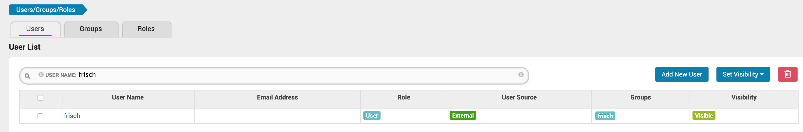
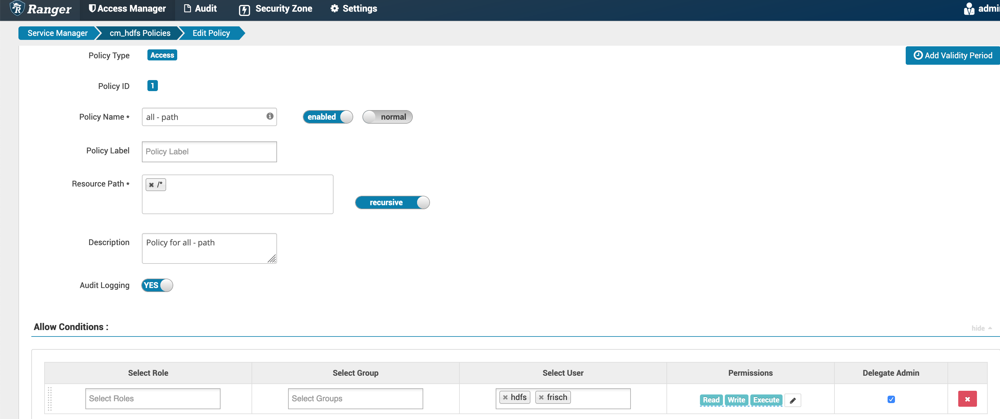

= Ranger and access policies

Now that cluster is well kerberized, a question is raised on how to access different services, files, APIs, UIs using different users.

For sake of simplicity, we will create one user called "frisch" with a simple password (or even no password).

Goal is also to provide ways of verification that policies are well working, and how to set them properly if it is not the case.

== Pre-Req

First, let's create a user account on all machines, create its kerberos keytab and propagate it to all machines, with only rights for him to read the keytab.

This user is: __frisch__ with no password (or password __cloudera123__), it belongs to group: __frisch__ +
Its keytab is named: __frisch.keytab__ under its home directory with rights: __400 frisch:frisch__ + 
Principal with realm created is: __frisch@FRISCH.COM__ 

On all nodes:

[source,bash]
useradd frisch

On node 1, where KDC is, create principal with password __admin__:

[source,bash]
[root@cdp-test-1 ~]# kadmin.local
Authenticating as principal admin/admin@FRISCH.COM with password.
kadmin.local:  addprinc frisch@FRISCH.COM
WARNING: no policy specified for frisch@FRISCH.COM; defaulting to no policy
Enter password for principal "frisch@FRISCH.COM": 
Re-enter password for principal "frisch@FRISCH.COM": 
Principal "frisch@FRISCH.COM" created.

On node 1, where KDC is, create keytab for this principal:

[source,bash]
[root@cdp-test-1 ~]# ktutil
ktutil:  add_entry -password -p frisch@FRISCH.COM -k 1 -e des-cbc-crc
Password for frisch@FRISCH.COM: 
ktutil:  add_entry -password -p frisch@FRISCH.COM -k 1 -e des-cbc-md5
Password for frisch@FRISCH.COM: 
ktutil:  add_entry -password -p frisch@FRISCH.COM -k 1 -e des3-cbc-sha1
Password for frisch@FRISCH.COM: 
ktutil:  wkt /home/frisch/frisch.keytab

Propagate the keytab to all nodes:

[source,bash]
scp /home/frisch/frisch.keytab root@cdp-test-X:/home/frisch

On all nodes, set proper rights to the keytab:

[source,bash]
chmod 400 /home/frisch/frisch.keytab
chown frisch:frisch /home/frisch/frisch.keytab 

On all nodes, Try a kinit tio check:

[source,bash]
su - frisch 
kinit -kt ~/frisch.keytab frisch@FRISCH.COM
klist

Result is: 

[source,bash]
----
Ticket cache: FILE:/tmp/krb5cc_2002
Default principal: frisch@FRISCH.COM

Valid starting       Expires              Service principal
03/24/2020 01:10:01  03/25/2020 01:10:01  krbtgt/FRISCH.COM@FRISCH.COM
	renew \until 03/31/2020 01:10:01
Last login: Tue Mar 24 01:07:23 PDT 2020

----

Note that user __frisch__ must now be accessible in Ranger admin, you can verify this by checking users in Settings > User/Groups/Roles :

Note that this script has been played on all nodes to allow user frisch to connect from an external machine with no password(as root):

[source,bash]
mkdir /home/frisch/.ssh/
cp /root/.ssh/authorized_keys /home/frisch/.ssh/
chmod 700 /home/frisch/.ssh/
chmod 600 /home/frisch/.ssh/authorized_keys
chown frisch:frisch /home/frisch/.ssh/
chown frisch:frisch /home/frisch/.ssh/authorized_keys

== HDFS

In HDFS configuration, superusergroup (__dfs.permissions.superusergroup__) has been modified to add group __frisch__ . 

However, even with this configuration, user frisch can not create its own directories... +

[source, bash]
[frisch@cdp-test-1 ~]$ hdfs dfs -ls /
Found 10 items
drwxrwxrwx   - root  hadoop              0 2020-01-17 06:14 /data
drwxr-xr-x   - hbase hbase               0 2020-03-23 23:18 /hbase
-rw-r--r--   3 hdfs  supergroup   27483022 2020-03-23 08:48 /randomy.csv
drwxr-xr-x   - hdfs  supergroup          0 2020-01-02 07:11 /ranger
drwxrwxr-x   - solr  solr                0 2020-01-02 07:14 /solr
-rw-r--r--   3 hdfs  supergroup  206149120 2020-03-17 11:17 /test.csv
-rw-r--r--   3 hdfs  supergroup  274843274 2020-03-17 02:25 /test.txt
drwxrwxrwt   - hdfs  supergroup          0 2020-01-02 07:12 /tmp
drwxr-xr-x   - hdfs  supergroup          0 2020-02-02 09:28 /user
drwxr-xr-x   - hdfs  supergroup          0 2020-01-02 07:11 /warehouse
[frisch@cdp-test-1 ~]$ hdfs dfs -mkdir /user/frisch
mkdir: Permission denied: user=frisch, access=WRITE, inode="/user":hdfs:supergroup:drwxr-xr-x

Moreover, because user hdfs does not exists on node (nologin option on /etc/passwd), it is mandatory to create an hdfs user manually to let him be able to change this, or at least use it keytab...

Hence, Ranger has been enabled for HDFS rights: HDFS > Configuration > HDFS Ranger authorization .

In Ranger UI, cdm_hdfs has been modified to enable authorization through Kerberos and make use of HDFS HA:

image::pictures/HDFSRangerconfig.png[Ranger HDFS configuration]

In Ranger, user frisch has been added to have all rights and this policy has been set to overrides other:

Now, it is possible to create frisch directories:

[source,bash]
[frisch@cdp-test-1 ~]$ hdfs dfs -mkdir /user/frisch
[frisch@cdp-test-1 ~]$ hdfs dfs -ls /user/
Found 11 items
drwxrwxrwx   - admin  admin               0 2020-03-03 11:14 /user/admin
drwxr-xr-x   - frisch supergroup          0 2020-03-24 01:55 /user/frisch
drwxr-xr-x   - hdfs   supergroup          0 2020-03-03 10:57 /user/hdfs
drwxrwxrwx   - mapred hadoop              0 2020-01-02 07:15 /user/history
drwxrwxr-t   - hive   hive                0 2020-03-18 03:03 /user/hive
drwxrwxr-x   - hue    hue                 0 2020-03-20 08:49 /user/hue
drwxrwxr-x   - impala impala              0 2020-01-02 07:11 /user/impala
drwxrwxr-x   - oozie  oozie               0 2020-01-02 07:12 /user/oozie
drwxr-x--x   - spark  spark               0 2020-01-02 07:12 /user/spark
drwxr-xr-x   - hdfs   supergroup          0 2020-01-02 07:11 /user/tez
drwxr-xr-x   - hdfs   supergroup          0 2020-01-02 07:13 /user/yarn

Note that, if no policies exists to prevent user to access a HDFS directory or file in Ranger, it defaults back to Ranger acl. 
This could be seen in Ranger audit tab.

== YARN

Ranger YARN plugin has been configured to use YARN HA & Kerberos authentication:

image::pictures/RangerYARNConf.png[Ranger YARN configuration]

== HBase

User frisch has been granted privileges on only one table (the one required):

image::pictures/RangerHBasePolicy.png[frisch Ranger HBase Policy]

HBase has been properly configured in Ranger (Note that master principal was given with name of the machine in it):

image::pictures/RangerHBaseConfiguration.png[Hbase Ranger configuration]

It is now possible to launch load of data into tables with names like "randomy".

== Hive

With actual configuration, users should be able to create their own database and tables and have full rights on it (thanks to {OWNER} policies existing already).

== Kafka

Ranger Kafka plugin is configured correctly.

However, There is currently an IO error and it's impossible to set security settings as they are not recognized...

Client error:

[source,bash]
20/03/24 10:35:59 WARN network.Selector: Error in I/O with cdp-test-4.gce.cloudera.com/172.31.116.154
java.io.EOFException
	at org.apache.kafka.common.network.NetworkReceive.readFrom(NetworkReceive.java:62)
	at org.apache.kafka.common.network.Selector.poll(Selector.java:248)
	at org.apache.kafka.clients.NetworkClient.poll(NetworkClient.java:192)
	at org.apache.kafka.clients.producer.internals.Sender.run(Sender.java:191)
	at org.apache.kafka.clients.producer.internals.Sender.run(Sender.java:122)
	at java.lang.Thread.run(Thread.java:748)

Server error:

[source,bash]
INFO org.apache.kafka.common.network.Selector: [SocketServer brokerId=1546332425] Failed authentication with /172.31.116.157 (Unexpected Kafka request of type METADATA during SASL handshake.)

Note that another error (not related) is popping up from Kafka, about rangertagsync user not being created:

[source,bash]
2020-03-24 10:36:33,362 WARN org.apache.hadoop.security.ShellBasedUnixGroupsMapping: unable to return groups for user rangertagsync
PartialGroupNameException The user name 'rangertagsync' is not found. id: rangertagsync: no such user
id: rangertagsync: no such user

== Ozone

Ranger has been activated through CM UI, Ozone was hence restarted.

However, nothing in the ranger audits appeared and even after an Ozone restart, it does not seems that it is taken into account, as those logs from the OM shows:

[source,bash]
2020-03-24 09:40:03,094 INFO SecurityLogger.org.apache.hadoop.ipc.Server: Auth successful for frisch@FRISCH.COM (auth:KERBEROS)
2020-03-24 09:40:03,103 INFO SecurityLogger.org.apache.hadoop.security.authorize.ServiceAuthorizationManager: Authorization successful for frisch@FRISCH.COM (auth:KERBEROS) for protocol=interface org.apache.hadoop.ozone.om.protocol.OzoneManagerProtocol

Moreover Ranger Ozone configuration leads to following error:

        java.lang.NoClassDefFoundError: org/apache/hadoop/ozone/client/OzoneClientFactory.org/apache/hadoop/ozone/client/OzoneClientFactory.

== SolR

When trying to activate Ranger for SolR, following error occured in CM:

[source,bash]
Caused by: java.lang.IllegalArgumentException: Cyclic dependency: DbService{id=1546332223, name=ranger} -> DbService{id=1546332270, name=solr} -> DbService{id=1546332223, name=ranger}
	at com.cloudera.cmf.service.DependencyUtils.getAllDependenciesInternal(DependencyUtils.java:377)
	at com.cloudera.cmf.service.DependencyUtils.getAllDependenciesInternal(DependencyUtils.java:392)
	at com.cloudera.cmf.service.DependencyUtils.getAllDependenciesInternal(DependencyUtils.java:392)
	at com.cloudera.cmf.service.DependencyUtils.getAllDependenciesInternal(DependencyUtils.java:392)
	at com.cloudera.cmf.service.DependencyUtils.getAllDependenciesInternal(DependencyUtils.java:392)
	at com.cloudera.cmf.service.DependencyUtils.getAllDependencies(DependencyUtils.java:359)
	at com.cloudera.cmf.service.components.DependencyCache.getDependencies(DependencyCache.java:74)
	at com.cloudera.cmf.service.components.ConfigHelper.getDependencies(ConfigHelper.java:208)
	at com.cloudera.cmf.service.components.ConfigHelper.getDependencies(ConfigHelper.java:217)
	at com.cloudera.cmf.service.AbstractRoleHandler.generateClientConfigsForDependencies(AbstractRoleHandler.java:1143)
	at com.cloudera.cmf.service.AbstractRoleHandler.generateConfigFiles(AbstractRoleHandler.java:1086)
	... 26 more
2020-03-24 10:13:29,970 WARN Staleness-Detector-2:com.cloudera.cmf.service.config.components.ProcessStalenessDetector: Encountered exception while performing staleness check subtask

