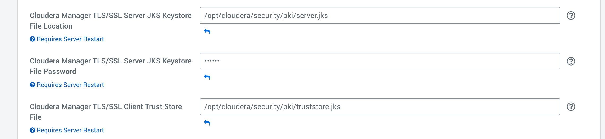
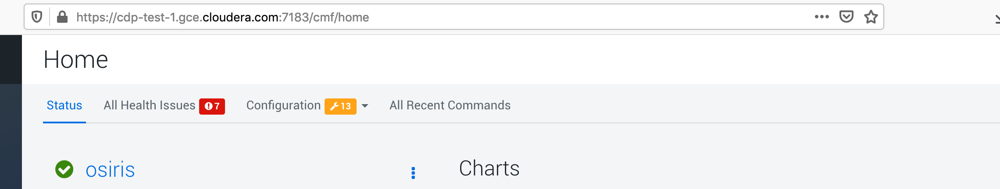

= Encryption of CM & agents

Goal is to provide Encryption to secure data and provide encryption for data in Transit and also UIs. 

== Pre-Req: Creation and deployment of Keys 

=== Generation of keys

Firstly, on all nodes, create a directory to store all certificates and relatives:

[source,bash]
mkdir -p /opt/cloudera/security/pki

Note that __cloudera__ is the password in use for all certificates.

==== Root certificate 

== Using CLDR existing ones

Download root certificate from http://sub-ca.ad.sec.cloudera.com/certsrv/certcarc.asp[http://sub-ca.ad.sec.cloudera.com/certsrv/certcarc.asp] +
Install it locally by clicking "Install this CA locally" http://sub-ca.ad.sec.cloudera.com/certsrv/certcarc.asp[http://sub-ca.ad.sec.cloudera.com/certsrv/certcarc.asp]

Be sure to get all chain certificates and read certificates with this command:
[source,bash]
openssl pkcs7 -print_certs -inform DER -in certnew.p7b 

From the output, create two files: __rootca.pem__ and __intca.pem__ .

Finally distribute certificate to all nodes, by sending it to __/opt/cloudera/security/pki__ folder.

On each node import the root certificate to the java keystore (this will able all Java applications to trust applications with a certificate signed by this authority) (password by default is : __changeit__):
[source,bash]
keytool -importcert -alias rootca -keystore /etc/pki/ca-trust/extracted/java/cacerts -file /opt/cloudera/security/pki/rootca.pem

A truststore.jks file will be also created by importing the root and intermediate certificate:
[source,bash]
keytool -importcert -alias rootca -keystore /opt/cloudera/security/pki/truststore.jks -file /opt/cloudera/security/pki/rootca.pem
keytool -importcert -alias intca -keystore /opt/cloudera/security/pki/truststore.jks -file /opt/cloudera/security/pki/intca.pem

=== Creating yours

First, create a key which will be your rootCA.key:
[source,bash]
openssl genrsa -out rootCA.key 4096

Then create a certificate from it:
[source,bash]
----
openssl req -x509 -new -nodes -key rootCA.key -sha256 -days 1024 -out rootCA.crt
You are about to be asked to enter information that will be incorporated
into your certificate request.
What you are about to enter is what is called a Distinguished Name or a DN.
There are quite a few fields but you can leave some blank
For some fields there will be a default value,
If you enter '.', the field will be left blank.
Country Name (2 letter code) [XX]:FR
State or Province Name (full name) []:FRANCE
Locality Name (eg, city) [Default City]:PARIS
Organization Name (eg, company) [Default Company Ltd]:Cloudera
Organizational Unit Name (eg, section) []:PS
Common Name (eg, your name or your server\'s hostname) []:ccycloud-1.fri2.root.hwx.site
Email Address []:frisch@cloudera.com
----

A truststore.jks must be created with rootCA in it:
[source,bash]
keytool -importcert -alias rootca -keystore /opt/cloudera/security/pki/truststore.jks -file /opt/cloudera/security/pki/rootCA.crt

Now, to sign CSR (certificate signing request) using this, you'll just need to do this:
[source,bash]
openssl x509 -req -CA rootCA.crt -CAkey rootCA.key -CAcreateserial -days 500 -sha256 -in $(hostname -f).csr -out $(hostname -f).crt

==== Server certificates

On each node, generate a certificate and its associated certificate sign request:

[source,bash]
keytool -genkeypair -alias $(hostname -f) -keyalg RSA -keystore /opt/cloudera/security/pki/$(hostname -f).jks -keysize 2048 -dname "CN=$(hostname -f)" -ext san=dns:$(hostname -f),dns:
keytool -certreq -alias $(hostname -f) -keystore /opt/cloudera/security/pki/$(hostname -f).jks -file /opt/cloudera/security/pki/$(hostname -f).csr -ext san=dns:$(hostname -f)

Get all csr generated and submit them to CA of Cloudera (http://sub-ca.ad.sec.cloudera.com/certsrv/certrqxt.asp[http://sub-ca.ad.sec.cloudera.com/certsrv/certrqxt.asp]).

Convert (if certificates are in DER format to PEM):
[source,bash]
openssl x509 -inform der -in $(hostname -f) -out $(hostname -f)

Put back certificates to its corresponding machine under __/opt/cloudera/security/pki/__.

On each node, import certificates signed along with the root certificate into the keystore that contains the key: 
[source,bash]
cat /opt/cloudera/security/pki/rootca.pem >> /opt/cloudera/security/pki/$(hostname -f).pem
keytool -importcert -alias $(hostname -f) -keystore /opt/cloudera/security/pki/$(hostname -f).jks -file /opt/cloudera/security/pki/$(hostname -f).pem 

Finally a kesytore.jks is created on each node:
[source,bash]
ln -s /opt/cloudera/security/pki/$(hostname -f).jks /opt/cloudera/security/pki/keystore.jks 

==== Final

Now, on each machine, there should be 3 files under __/opt/cloudera/security/pki/__: +
- A certificate in jks format, that will be used by Java applications linked to the machine, this is what we call keystore.jks +
- A CSR (certificate sign request) no longer needed +
- A certificate signed in PEM format, that will be used by applications +
- A root certificate in PEM format, that has been imported into Java truststore +
- A root certificate in JKS format, which is what we call a truststore.jks, it will be used by Java applications

Depending on how you generated certificates, you could have different (but still similar) files under __/opt/cloudera/security/pki/__:

Using a CA certificates signer:
[source,bash]
lrwxrwxrwx 1 root root   58 Mar 26 03:53 agent.pem -> /opt/cloudera/security/pki/cdp-test-1.gce.cloudera.com.pem
-rw-r--r-- 1 root root 1055 Mar 26 02:03 cdp-test-1.gce.cloudera.com.csr
-rw-r--r-- 1 root root 8107 Mar 26 07:34 cdp-test-1.gce.cloudera.com.jks
-rw-r--r-- 1 root root 4618 Mar 26 07:33 cdp-test-1.gce.cloudera.com.pem
lrwxrwxrwx 1 root root   58 Mar 26 07:43 keystore.jks -> /opt/cloudera/security/pki/cdp-test-1.gce.cloudera.com.jks
-rw-r--r-- 1 root root 2045 Mar 26 03:05 rootca.pem
lrwxrwxrwx 1 root root   58 Mar 26 07:14 server.jks -> /opt/cloudera/security/pki/cdp-test-1.gce.cloudera.com.jks
-rw-r--r-- 1 root root 1532 Mar 26 07:52 truststore.jks

Using self-signed certificates:
[source,bash]
total 52
-r--r--r-- 1 root root 3688 Apr 10 07:27 ccycloud-2.fri2.root.hwx.site.crt
-r--r--r-- 1 root root 1105 Apr 10 07:23 ccycloud-2.fri2.root.hwx.site.csr
-r--r--r-- 1 root root 4025 Apr 10 07:27 ccycloud-2.fri2.root.hwx.site.jks
-r--r--r-- 1 root root 4773 Apr 10 07:28 ccycloud-2.fri2.root.hwx.site.p12
-r--r--r-- 1 root root 6378 Apr 10 07:29 ccycloud-2.fri2.root.hwx.site.pem
lrwxrwxrwx 1 root root   60 Apr 10 08:02 certificate.pem -> /opt/cloudera/security/pki/ccycloud-2.fri2.root.hwx.site.crt
lrwxrwxrwx 1 root root   60 Apr 10 07:30 key.pem -> /opt/cloudera/security/pki/ccycloud-2.fri2.root.hwx.site.pem
lrwxrwxrwx 1 root root   60 Apr 10 07:30 keystore.jks -> /opt/cloudera/security/pki/ccycloud-2.fri2.root.hwx.site.jks
-r--r--r-- 1 root root 2155 Apr 10 07:16 rootCA.crt
-r-------- 1 root root 3243 Apr 10 07:26 rootCA.key
-r--r--r-- 1 root root 1612 Apr 10 07:35 truststore.jks

Above, rootCA.key was generated so it is present but only with root read access. There are also certificate file in pem format and in p12 format as they were used to convert from jks to pem.

If you list entries in keystore.jks, you have one privateKeyEntry (which in fact is enriched by corresponding signed certificate & root ca, to have the whole chain of certification):
[source,bash]
----
[root@cdp-test-2 ~]# keytool -list -keystore /opt/cloudera/security/pki/keystore.jks 
Enter keystore password:  

*****************  WARNING WARNING WARNING  *****************
* The integrity of the information stored in your keystore  *
* has NOT been verified!  In order to verify its integrity, *
* you must provide your keystore password.                  *
*****************  WARNING WARNING WARNING  *****************

Keystore type: jks
Keystore provider: SUN

Your keystore contains 1 entry

cdp-test-2.gce.cloudera.com, Mar 26, 2020, PrivateKeyEntry, 
Certificate fingerprint (SHA1): 86:0F:91:90:D1:1B:13:E6:48:51:54:36:5A:63:25:4E:26:3E:94:D8
----

If you list entries in truststore.jks, there is only one which is the trusted root certificate:
[source,bash]
----
[root@cdp-test-1 pki]# keytool -list -keystore /opt/cloudera/security/pki/truststore.jks 
Enter keystore password:  

*****************  WARNING WARNING WARNING  *****************
* The integrity of the information stored in your keystore  *
* has NOT been verified!  In order to verify its integrity, *
* you must provide your keystore password.                  *
*****************  WARNING WARNING WARNING  *****************

Keystore type: jks
Keystore provider: SUN

Your keystore contains 2 entries

rootca, Mar 26, 2020, trustedCertEntry, 
Certificate fingerprint (SHA1): 1F:94:E0:C1:F6:FE:07:72:9C:C1:2B:69:05:9B:55:79:39:4A:02:30
intca, Mar 26, 2020, trustedCertEntry, 
Certificate fingerprint (SHA1): B6:44:38:E6:2E:C3:08:A0:23:14:84:C6:DF:6F:53:D7:38:C7:CA:48
----

== CM security

Goal is to set up security for Cloudera Manager and agents by enabling encryption of communication between CM and its agents and also securize the CM UI.

It is necessary to make a new symlink on all nodes to allow cloudera agent to use the pem file:

[source,bash]
ln -s /opt/cloudera/security/pki/$(hostname -f).pem /opt/cloudera/security/pki/agent.pem

Then on CM server instance, it is also mandatory to create a symlink (on JKS format this time):

[source,bash]
ln -s /opt/cloudera/security/pki/$(hostname -f).jks /opt/cloudera/security/pki/server.jks

CM should be configured with this (Administration > Settings > Security):

A restart of CM must be made:
[source,bash]
systemctl restart cloudera-scm-server

Now, CM UI is on https protocol and port is 7183.

Note that CM agent and CMS must be configured to talk in a secure way with CM.

