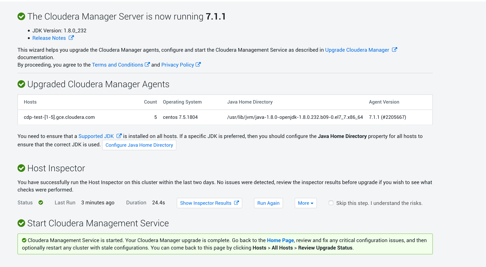

= Upgrade CM & Agents from 7.0.3 to 7.1.1

Note that latest build is http://cloudera-build-3-us-west-2.vpc.cloudera.com/s3/build/2397691/, however, cm.repo was not found under it, hence using this one instead: http://cloudera-build-us-west-1.vpc.cloudera.com/s3/build/2205667/cm7/7.1.1/redhat7/yum/ .

On all nodes, adding a new repo cloudera-manager_7_1.repo under __/etc/yum.repos.d/__:

[source,bash]
[cloudera-manager]
name=Cloudera Manager 7.1.1
baseurl=http://cloudera-build-us-west-1.vpc.cloudera.com/s3/build/2205667/cm7/7.1.1/redhat7/yum/ 
gpgkey=http://cloudera-build-us-west-1.vpc.cloudera.com/s3/build/2205667/cm7/7.1.1/redhat7/yum/RPM-GPG-KEY-cloudera
gpgcheck=1
enabled=1
autorefresh=0
type=rpm-md

== Backup

__Note that backup will only be on node where CM is installed (i.e cdp-test-1).__

Collect database information on file __/etc/cloudera-scm-server/db.properties__.

Using CM UI, stop all CMS services.

Create backup directory:
[source,bash]
export CM_BACKUP_DIR="`date +%F`-CM7.0.3"
echo $CM_BACKUP_DIR
mkdir -p $CM_BACKUP_DIR

Stop CM & Agent:
[source,bash]
systemctl stop cloudera-scm-server 
systemctl stop cloudera-scm-agent 

Backup Agent data:
[source,bash]
tar -cf ${CM_BACKUP_DIR}/cloudera-scm-agent.tar --exclude=*.sock /etc/cloudera-scm-agent /etc/default/cloudera-scm-agent /var/runcloudera-scm-agent /var/lib/cloudera-scm-agent

Backup repo data:
[source,bash]
tar -cf ${CM_BACKUP_DIR}/repository.tar /etc/yum.repos.d 

Backup CMS data:
[source,bash]
cp -rp /var/lib/cloudera-service-monitor /var/lib/cloudera-service-monitor-${CM_BACKUP_DIR}
cp -rp /var/lib/cloudera-host-monitor /var/lib/cloudera-host-monitor-${CM_BACKUP_DIR}
cp -rp /var/lib/cloudera-scm-eventserver /var/lib/cloudera-scm-eventserver-${CM_BACKUP_DIR}

Backup Database (here it is a PSQL one):
[source,bash]
pg_dump -h cdp-test-1 -U postgres -W -p 5432 scm > $HOME/scm-backup-${CM_BACKUP_DIR}
pg_dump -h cdp-test-1 -U postgres -W -p 5432 rman > $HOME/rman-backup-${CM_BACKUP_DIR}
pg_dump -h cdp-test-1 -U postgres -W -p 5432 amon > $HOME/amon-backup-${CM_BACKUP_DIR}

Backup CM data:
[source,bash]
tar -cf $CM_BACKUP_DIR/cloudera-scm-server.tar /etc/cloudera-scm-server /etc/default/cloudera-scm-server

== Upgrades

Upgrade CM & Agent (still on node cdp-test-1):
[source,bash]
yum clean all
yum upgrade cloudera-manager-server cloudera-manager-daemons cloudera-manager-agent 

Note that this output should appear:
[source,bash]
----
=============================================================================================================================================================================
 Package                                          Arch                           Version                                      Repository                                Size
=============================================================================================================================================================================
Updating:
 cloudera-manager-agent                           x86_64                         7.1.1-2205667.el7                            cloudera-manager                          12 M
 cloudera-manager-daemons                         x86_64                         7.1.1-2205667.el7                            cloudera-manager                         1.4 G
 cloudera-manager-server                          x86_64                         7.1.1-2205667.el7                            cloudera-manager                          12 k

Transaction Summary
=============================================================================================================================================================================
Upgrade  3 Packages
----

Check right packages have been installed:
[source,bash]
rpm -qa 'cloudera-manager-*'

Output should be:
[source,bash]
cloudera-manager-daemons-7.1.1-2205667.el7.x86_64
cloudera-manager-agent-7.1.1-2205667.el7.x86_64
cloudera-manager-server-7.1.1-2205667.el7.x86_64

Restart agent & CM:
[source,bash]
systemctl start cloudera-scm-agent
systemctl start cloudera-scm-server

Now, CM 7.1.1 should be started and listening on: https://cdp-test-1.gce.cloudera.com:7183/cmf

It is either possible to upgrade agents via CM UI or directly with command line to launch on all remaining hosts:
[source,bash]
systemctl stop cloudera-scm-agent
yum clean all
yum repolist
yum upgrade -y cloudera-manager-daemons cloudera-manager-agent

Check it has been well updated:
[source,bash]
rpm -qa 'cloudera-manager-*'

Restart it:
[source,bash]
systemctl start cloudera-scm-agent

Using CM UI, it is now possible to restart all CMS services.

Finalizing via CM UI the CM & agent upgrade should lead to:

