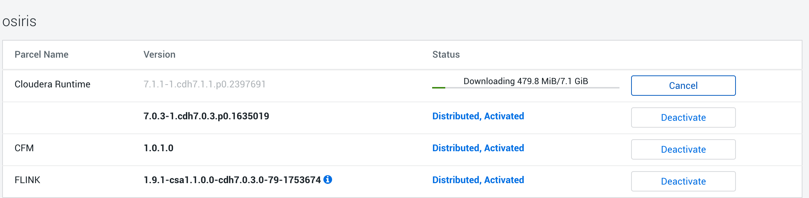
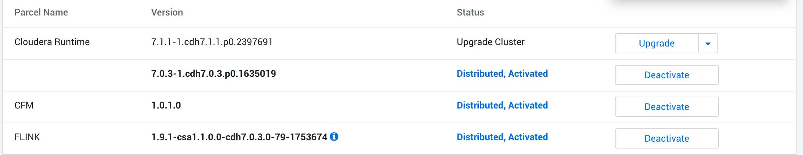
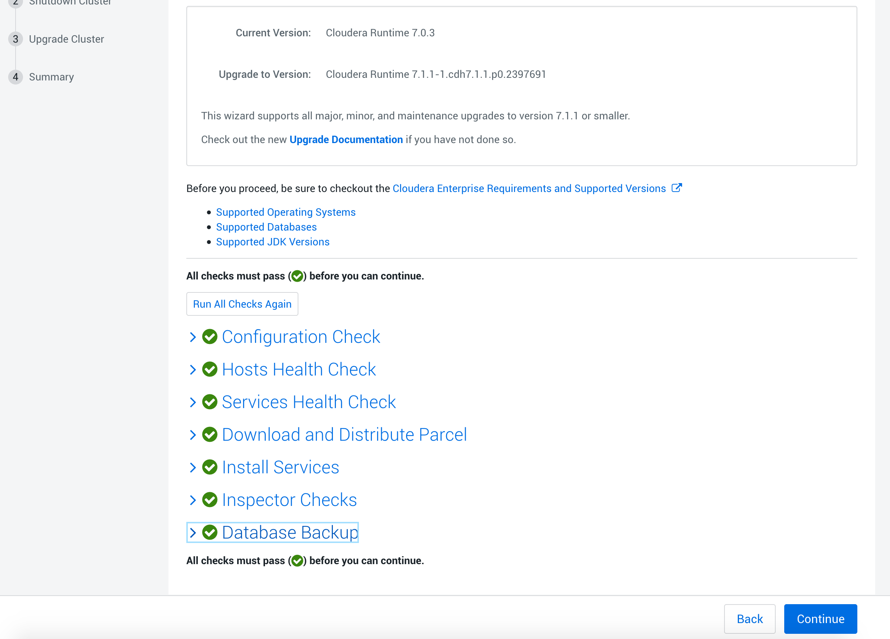
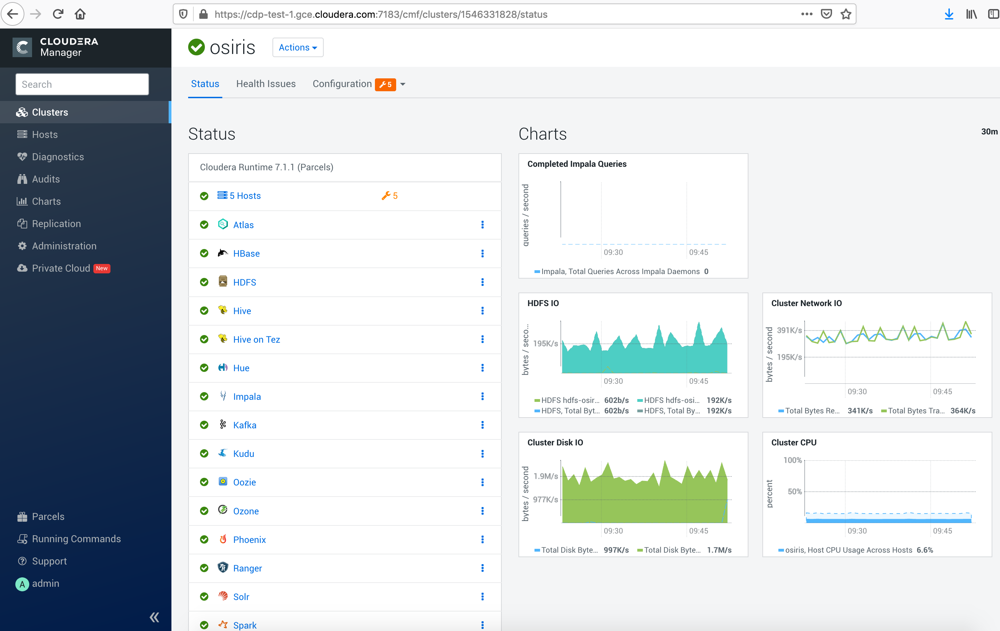

= Services upgrade

Goal is to upgrade all CDP services installed.

This upgrade will use CM UI upgrade tool.

== Backup

Some services will demand backups:

Hive, Ranger, Hue, Oozie databases backup:
[source,bash]
export CM_BACKUP_DIR="`date +%F`-CM7.0.3"
pg_dump -h cdp-test-1 -U postgres -W -p 5432 hue > $HOME/scm-backup-${CM_BACKUP_DIR}
pg_dump -h cdp-test-1 -U postgres -W -p 5432 oozie > $HOME/scm-backup-${CM_BACKUP_DIR}
pg_dump -h cdp-test-1 -U postgres -W -p 5432 ranger > $HOME/scm-backup-${CM_BACKUP_DIR}
pg_dump -h cdp-test-1 -U postgres -W -p 5432 metastore > $HOME/scm-backup-${CM_BACKUP_DIR}

Zookeeper backup by running this on all Zookeeper nodes:
[source,bash]
export CM_BACKUP_DIR="`date +%F`-CM7.0.3"
cp -rp /var/lib/zookeeper/ /var/lib/zookeeper-backup-$CM_BACKUP_DIR

HDFS backup of JN:
[source,bash]
export CM_BACKUP_DIR="`date +%F`-CM7.0.3"
cp -rp /dfs/jn /dfs/jn-

HDFS backup NN:
[source,bash]
mkdir -p /etc/hadoop/conf.rollback.namenode
cd /var/run/cloudera-scm-agent/process/ && cd `ls -t1 | grep -e "-NAMENODE\$" | head -1`
cp -rp * /etc/hadoop/conf.rollback.namenode/
rm -rf /etc/hadoop/conf.rollback.namenode/log4j.properties
cp -rp /etc/hadoop/conf.cloudera.hdfs-osiris/log4j.properties /etc/hadoop/conf.rollback.namenode/

HDFS backup DN:
[source,bash]
mkdir -p /etc/hadoop/conf.rollback.datanode/
cd /var/run/cloudera-scm-agent/process/ && cd `ls -t1 | grep -e "-DATANODE\$" | head -1`
cp -rp * /etc/hadoop/conf.rollback.datanode/
cp -rp /etc/hadoop/conf.cloudera.hdfs-osiris/log4j.properties /etc/hadoop/conf.rollback.datanode/ 

SolR backup via CM UI:
- Stop Solr +
- SolR > Actions > Backup Solr Configuration Meta-data for Upgrade

Hue Backup:
[source,bash]
export CM_BACKUP_DIR="`date +%F`-CM7.0.3"
 mkdir -p /opt/cloudera/parcels_backup/
cp -rp /opt/cloudera/parcels/CDH/lib/hue/app.reg /opt/cloudera/parcels_backup/app.reg-$CM_BACKUP_DIR

== Upgrade

In CM UI, Parcels > Parcel Repositories & Network Settings :
Add a new parcel link: link:http://cloudera-build-3-us-west-2.vpc.cloudera.com/s3/build/2397691/cdh/7.x/parcels/[http://cloudera-build-3-us-west-2.vpc.cloudera.com/s3/build/2397691/cdh/7.x/parcels/] .

Once, this is added, a new distribution of CDH (7.1.1) will appear to be downloaded and distributed.

Download it, distribute it, 

Note that, it is possible to raise distribution rate (if your network is strong enough) by setting above the defaukt 50MB/s.

Note that it is required to have at least 20GB of free space under __/opt/cloudera/parcels/__, as new parcels are wheighting around 7GB compressed.

Then, Upgrade is available:

Before going to upgrade, a full restart of all services is needed as configurations changed.

Once all services have restart, Parcels > Upgrade. 

All checks must be clear, if not, solving them is essential (check link:8-3_Upgrade_Troubleshoots.adoc[8-3_Upgrade_Troubleshoots.adoc]):

Then manual upgrade was choosen and a manual restart of whole cluster was made.

For Hive, use:

Recreate tables using CM: Hive > Actions > Create Metastore Hive database tables 
Hive > Actions > Upgrade Hive Metastore Database Schema 
Hive > Actions >  Validate Hive Metastore schema

Atlas needs to be reinitialized: Atlas > Actions > 

Redeploy also needed libraries and jars for Tez, Oozie using CM UI.

A final complete restart is done to complete upgrade.

= Verification of Services working well

UIs = Ok
Inserts = Oks (unless Kafka but was not working before).

= Insertions

HDFS = Ok with no more classpath
HBase = Ok with classpath /opt/cloudera/parcels/CDH/lib/hbase/
Hive = Very Long queries to just insert one by one but OK
SolR = OK
Kafka = OK without Kerberos+TLS
Ozone = KO du to error on classpath:

