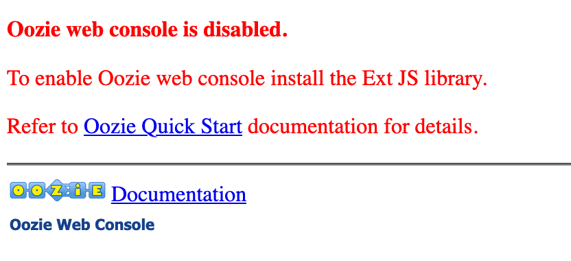

= Troubleshoots

== Atlas UI Password

Changing Atlas UI password is challenging as it is not working through CM...

As a workaround to be able to authentify to Atlas, process is to enable file authentication and change file password. +
Note that this method is subject to possible security threats (file is 644 rigths).

- Atlas > Configuration > Enable file authentication 
- Go on server 1 & 2 (where Atlas servers are installed) and change this file __/opt/cloudera/parcels/CDH-7.0.3-1.cdh7.0.3.p0.1635019/etc/atlas/conf.dist/users-credentials.properties__ by adding an entry: __fri=ADMIN::60fe74406e7f353ed979f350f2fbb6a2e8690a5fa7d1b0c32983d1d8b3f95f67__
- Restart Atlas servers
- Log in with: fri/Admin1234

Note that password is a sha-256 obtained by linux command: __echo -n Admin1234 | sha256sum__ +
Note that even if you change admin password, it will not work.

== Ozone data is not automatically erased

Ozone data is not deleted, even after deleting keys, buckets and volumes. +
Hence removing files directly on datanodes allowed to gain space: /var/lib/hadoop-ozone/datanode/ratis/data/ & /hadoop-ozone/datanode/data/hdds/  but lead to SCM being in safe mode and not leaving it.

== Ozone SCM is in safe mode

SCM was not working as it was not leaving safe mode, looking at logs, showed it was attending from datanodes to report some blocks, 
but they were previously deleted.

Solution was to delete all files under: /var/lib/hadoop-ozone/scm/data on SCM node. +
This forced SCM to reinitialize itself. 

== Ozone does not start OM & DN after shutdown of cluster

This error occurs in logs after shutdown and restart cluster: 
SCM version info mismatch.

On OM node, under __/var/lib/hadoop-ozone/om/data/om/current/VERSION__, there is a file named __VERSION__, deleting this file does not resolve (and brings another error: "Om not initialized"). +
To solve it, this file was modified to set the righ ID for scm by modifying lines: __scmUuid=__ & __clusterID=__ , and setting the ones from this file present in scm node: __/var/lib/hadoop-ozone/scm/data/scm/current/VERSION__

== Ozone is an inconsistent state

so changing version on data node under: __/hadoop-ozone/datanode/data/hdds/VERSION__ file, leads to below error:

[source,bash]
2020-03-23 05:51:51,832 ERROR org.apache.hadoop.ozone.container.common.states.endpoint.VersionEndpointTask: Volume /hadoop-ozone/datanode/data/hdds is in Inconsistent state, expected scm directory /hadoop-ozone/datanode/data/hdds/3828eef4-aeb9-4ad7-a51b-a5831abb10ba does not exist
2020-03-23 05:51:51,833 INFO org.apache.hadoop.ozone.container.common.volume.VolumeSet: Moving Volume : /hadoop-ozone/datanode/data/hdds to failed Volumes
2020-03-23 05:51:51,833 WARN org.apache.hadoop.fs.CachingGetSpaceUsed: Thread Interrupted waiting to refresh disk information: sleep interrupted
2020-03-23 05:51:51,834 ERROR org.apache.hadoop.ozone.container.common.statemachine.StateContext: Critical error occurred in StateMachine, setting shutDownMachine

Creating directory with right permissions and data in it (from previous directory) leads to an inconsistent state (see below):

[source,bash]
2020-03-23 06:16:10,074 WARN org.apache.ratis.metrics.impl.MetricRegistriesImpl: First MetricRegistry has been created without registering reporters. You may need to call MetricRegistries.global().addReportRegistration(...) before.
2020-03-23 06:16:10,074 WARN org.apache.ratis.metrics.impl.MetricRegistriesImpl: First MetricRegistry has been created without registering reporters. You may need to call MetricRegistries.global().addReportRegistration(...) before.
2020-03-23 06:16:11,961 ERROR org.apache.hadoop.ozone.container.common.statemachine.StateContext: Critical error occurred in StateMachine, setting shutDownMachine
2020-03-23 06:16:13,862 ERROR org.apache.hadoop.ozone.container.common.statemachine.DatanodeStateMachine: DatanodeStateMachine Shutdown due to an critical error
2020-03-23 06:16:18,864 ERROR org.apache.hadoop.ozone.container.common.statemachine.DatanodeStateMachine: Error attempting to shutdown.
java.lang.InterruptedException
	at java.util.concurrent.locks.AbstractQueuedSynchronizer$ConditionObject.awaitNanos(AbstractQueuedSynchronizer.java:2067)

Solution was to completely move data from old directory (__a4824431-190c-4f2e-8b5e-c10803ee0f07__) to new one (__3828eef4-aeb9-4ad7-a51b-a5831abb10ba__) on each node.

=> Note that this seems to make Ozone inconsistent as reading keys was not working anymore for the previous collection.

== Oozie UI not working

Oozie UI is not working as there is a missing library:

Solution is to:
- Stop Oozie +
- Go to node where Oozie is running +
- Download library with this command: 
[source,bash]
wget http://archive.cloudera.com/gplextras/misc/ext-2.2.zip

- Unzip it under __/var/lib/oozie/__
- Restart Oozie

UI is ok after this manipulation.

== PostgreSQL is suffering from lack of connections

In Ranger logs and after a Hue restart, web-server was unable to connect due to this error:

		OperationalError: FATAL:  remaining connection slots are reserved for non-replication superuser connections		

Two potential problems: 
- Some services are not properly closing connections to PSQL, hence they let them open
- There are not enough connections for PSQL

Solution choosen was to raise __max_connections__ from 100 to 1000 in file __/var/lib/pgsql/data/postgresql.conf__ .
Then a restart of PostgreSQL was made, and also of Hue, Ranger, Hive, Oozie to clear all previous connections.

In case, this happens again, 

PSQL query to get current connections and their state:

[source,sql]
SELECT count(*),
       state,
	   usename,
	   usesysid
FROM pg_stat_activity
GROUP BY 2,3,4;

== Hive containers are staying up after query execution.

This is just a matter of configuration but it is usually annoying and it renders false metrics when benchmarking and cause confusion when trying to debug which things are running.

To avoid Hive containers staying up and running, configure tez to not reuse am containers: set __tez.am.container.reuse.enabled__ to false.

But note that this did not worked... 

== Cloudera Agent on CM node SSL not working

Once Cloudera Agent are configured to verify CM identity, it involves this error:
[source, bash]
[26/Mar/2020 09:33:19 +0000] 28664 MainThread agent        ERROR    Heartbeating to localhost:7182 failed.
Traceback (most recent call last):
  File "/opt/cloudera/cm-agent/lib/python2.7/site-packages/cmf/agent.py", line 1425, in _send_heartbeat
    self.cfg.max_cert_depth)
  File "/opt/cloudera/cm-agent/lib/python2.7/site-packages/cmf/https.py", line 155, in __init__
    self.conn.connect()
  File "/opt/cloudera/cm-agent/lib/python2.7/site-packages/M2Crypto/httpslib.py", line 69, in connect
    sock.connect((self.host, self.port))
  File "/opt/cloudera/cm-agent/lib/python2.7/site-packages/M2Crypto/SSL/Connection.py", line 309, in connect
    ret = self.connect_ssl()
  File "/opt/cloudera/cm-agent/lib/python2.7/site-packages/M2Crypto/SSL/Connection.py", line 295, in connect_ssl
    return m2.ssl_connect(self.ssl, self._timeout)
SSLError: certificate verify failed

=> Modification on config.ini was made to point to right node where CM is working.

== Kafka not starting after a change ok zkNode

Error is:
[source,bash]
2020-04-03 00:07:03,174 INFO kafka.server.KafkaServer: Cluster ID = KExScxmJQji6Ixf3chAeQA
2020-04-03 00:07:03,186 ERROR kafka.server.KafkaServer: Fatal error during KafkaServer startup. Prepare to shutdown
kafka.common.InconsistentClusterIdException: The Cluster ID KExScxmJQji6Ixf3chAeQA doesn't match stored clusterId Some(DzlLGaw2R7ywvGOsKwZ3PA) in meta.properties. The broker is trying to join the wrong cluster. Configured zookeeper.connect may be wrong.
	at kafka.server.KafkaServer.startup

Cluster id in zookeeper:
[source,bash]
[zk: cdp-test-2:2181(CONNECTED) 13] get /kafka3/cluster/id
{"version":"1","id":"KExScxmJQji6Ixf3chAeQA"}

A new clusterId was set in zookeeper on the new znode when restarting Kafka, however file __/var/local/kafka/data/meta.properties__ was not updated.

A manual update of this file made it work.

== Kafka unable to produce data

When trying to produce data, kafka throws:

[source,bash]
20/04/03 00:22:28 WARN clients.NetworkClient: [Producer clientId=console-producer] Error while fetching metadata with correlation id 715 : {test-2=LEADER_NOT_AVAILABLE}
20/04/03 00:22:28 WARN clients.NetworkClient: [Producer clientId=console-producer] Error while fetching metadata with correlation id 716 : {test-2=LEADER_NOT_AVAILABLE}

Active Controller has these logs:

[source,bash]
2020-04-03 00:22:28,794 INFO kafka.controller.KafkaController: [Controller id=1546344845] New topics: [Set(test-2)], deleted topics: [Set()], new partition replica assignment [Map(test-2-0 -> ReplicaAssignment(replicas=1546344861, addingReplicas=, removingReplicas=))]
2020-04-03 00:22:28,794 INFO kafka.controller.KafkaController: [Controller id=1546344845] New partition creation callback for test-2-0
2020-04-03 00:22:28,807 ERROR kafka.server.KafkaApis: [KafkaApi-1546344845] Error when handling request: clientId=1546344845, correlationId=5, api=UPDATE_METADATA, version=6, body={controller_id=1546344845,controller_epoch=1,broker_epoch=81604510222,topic_states=[{topic_name=test-2,partition_states=[{partition_index=0,controller_epoch=1,leader=1546344861,leader_epoch=0,isr=[1546344861],zk_version=0,replicas=[1546344861],offline_replicas=[],_tagged_fields={}}],_tagged_fields={}}],live_brokers=[{id=1546344845,endpoints=[{port=9093,host=cdp-test-3.gce.cloudera.com,listener=SASL_SSL,security_protocol=3,_tagged_fields={}}],rack=null,_tagged_fields={}},{id=1546344861,endpoints=[{port=9093,host=cdp-test-5.gce.cloudera.com,listener=SASL_SSL,security_protocol=3,_tagged_fields={}}],rack=null,_tagged_fields={}},{id=1546344853,endpoints=[{port=9093,host=cdp-test-4.gce.cloudera.com,listener=SASL_SSL,security_protocol=3,_tagged_fields={}}],rack=null,_tagged_fields={}}],_tagged_fields={}}
org.apache.kafka.common.errors.ClusterAuthorizationException: Request Request(processor=2, connectionId=172.31.115.225:9093-172.31.115.225:48376-0, session=Session(User:kafka,cdp-test-3.gce.cloudera.com/172.31.115.225), listenerName=ListenerName(SASL_SSL), securityProtocol=SASL_SSL, buffer=null) is not authorized.
2020-04-03 00:22:28,809 ERROR state.change.logger: [Controller id=1546344845] Received error in LeaderAndIsr response LeaderAndIsrResponseData(errorCode=31, partitionErrors=[LeaderAndIsrPartitionError(topicName='test-2', partitionIndex=0, errorCode=31)]) from broker 1546344861
