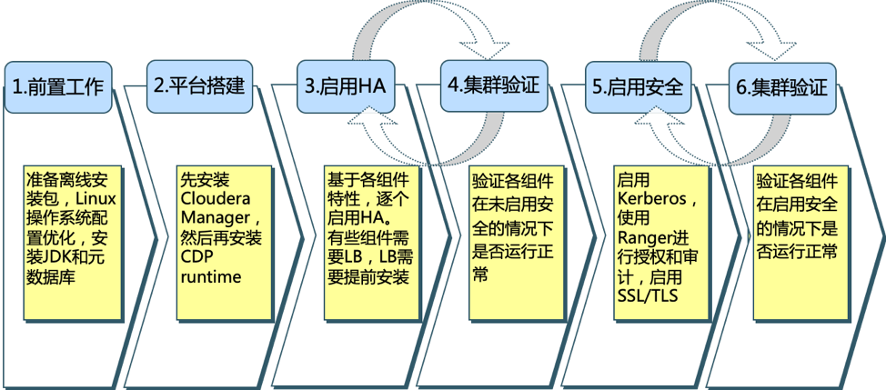

= README

== 内容介绍
本文介绍如何在Centos7.x上安装CDP7.1.x。

https://docs.cloudera.com/cloudera-manager/7.1.3/installation/topics/cdpdc-installation.html[官网安装文档]

CDP安装部署一般分成六个阶段：

== 文档/脚本/目录说明

.文档说明

|===
|文档 | 内容说明

|link:01_System_checks.adoc[01_System_checks.adoc]
|前置工作：如何准备离线安装包，优化Linux操作系统配置

|link:02_Pre_Installation.adoc[02_Pre_Installation.adoc]
|前置工作：如何安装JDK和元数据库

|link:03_CM_Installation.adoc[03_CM_Installation.adoc]
|平台搭建：如何安装Cloudera Manager

|link:04_CDP_Installation.adoc[04_CDP_Installation.adoc]
|平台搭建：如何安装CDP

|link:05_Add_other_services.adoc[05_Add_other_services.adoc]
|平台搭建：如何安装CDF等组件

|link:06_Enable_HA.adoc[06_Enable_HA.adoc]
|启用HA：如何给不同组件配置高可用

|link:07_Cluster_validation.adoc[07_Cluster_validation.adoc]
|集群验证：针对非安全集群和安全集群的验证方法

|link:08_Enable_Kerberos.adoc[08_Enable_Kerberos.adoc]
|启用安全：如何启用Kerberos

|link:09_Ranger_Access_Policies.adoc[09_Ranger_Access_Policies.adoc]
|启用安全：如何配置Ranger Policy

|link:10_Encryption-CM.adoc[10_Encryption-CM.adoc]
|启用安全：对CM&Agent配置TLS

|link:11_Encryption-Services.adoc[11_Encryption-Services.adoc]
|启用安全：对CDP各组件配置TLS

|link:12_Troubleshoots.adoc[12_Troubleshoots.adoc]
|问题汇总

|link:README.adoc[README.adoc]
|总体介绍
|===

.目录说明

|===
|目录 | 内容说明

|link:data[data]
|存放集群验证过程中需要的一些csv文件

|link:pictures[pictures]
|存放文档描述中引用的图片

|link:tools[tools]
|存放配置文件
|===

.脚本说明

|===
|脚本 | 内容说明

|link:install_full_script.sh[install_full_script.sh]
|CDP安装代码

|link:multi_thread_execution.sh[multi_thread_execution.sh]
|远程执行script.sh，针对不同主机多线程并行

|link:script.sh[script.sh]
|切割CDP安装代码，拷贝到该脚本中

|link:single_thread_execution.sh[single_thread_execution.sh]
|远程执行script.sh，针对不同主机串行操作
|===

== 安装方式说明

本文档有两种安装方式：

. 远程执行script.sh: 代码全部来自link:install_full_script.sh[install_full_script.sh]

. 在CM页面上执行安装步骤: 在各文档中有详细描述
